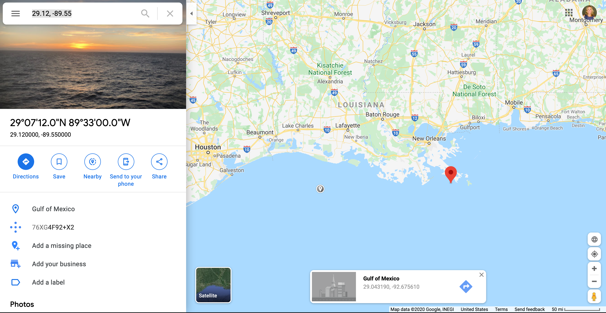

<!--Yeah... I have really long code chunks, so I just changed the default size :)-->
<style type="text/css">
pre{
  font-size:20px;
}
code.r,code.cpp{
  font-size:large
}
</style>


```{r include=FALSE}
library(knitr)
hook_output <- knit_hooks$get("output")
knit_hooks$set(output = function(x, options) {
  lines <- options$output.lines
  if (is.null(lines)) {
    return(hook_output(x, options))  # pass to default hook
  }
  x <- unlist(strsplit(x, "\n"))
  more <- "..."
  if (length(lines) == 1) {        # first n lines
    if (length(x) > lines) {
      # truncate the output, but add ....
      x <- c(head(x, lines), more)
    }
  } else {
    x <- c(more, x[lines], more)
  }
  # paste these lines together
  x <- paste(c(x, ""), collapse = "\n")
  hook_output(x, options)
})
knit_hooks$set(output = function(x, options) {
  # this hook is used only when the linewidth option is not NULL
  if (!is.null(n <- options$linewidth)) {
    x = knitr:::split_lines(x)
    # any lines wider than n should be wrapped
    if (any(nchar(x) > n)) x = strwrap(x, width = n)
    x = paste(x, collapse = '\n')
  }
  hook_output(x, options)
})

opts_chunk$set(
  echo = TRUE,
  fig.width = 7, 
  fig.align = 'center',
  fig.asp = 0.618, # 1 / phi
  out.width = "700px")
```

```{r, echo = FALSE}
library(sass)
sass(sass_file("theme.sass"), output = "theme.css")
```

## Exploratory Data Analysis

* Exploratory data analysis is the process of summarizing data
* It should be the first step in your analysis pipeline
* It involves:
--

  + checking data (import issues, outliers, missing values, data errors)
  + cleaning data
  + summary statistics of key variables (univariate and bivariate)
  + basic plots and graphs

---
## Pipeline
.center[

]

EDA involves Import -> Tidy -> Transform -> Visualize. Basically it is everything before we do modeling, prediction or inference.

---
## EDA Checklist

The goal of EDA is to better understand your data. Let's use the **checklist**:
--

1.  Formulate a question
--

2.  Read in the data
--

3.  Check the dimensions and headers and footers of the data
--

4.  Check the variable types in the data
--

5.  Take a closer look at some/all of the variables
--

6.  Validate with an external source
--

7.  Conduct some summary statistics to answer the initial question
--

8.  Make exploratory graphs

---
## Case study

We are going to use a dataset created from the National Center for Environmental Information (https://www.ncei.noaa.gov/). The data are 2019 hourly measurements from weather stations across the continental U.S.

.center[

]

---

## Formulate a Question

It is a good idea to first have a question such as:
--

  * what weather stations reported the hottest and coldest daily temperatures? 
  * what day of the month was on average the hottest?
  * is there covariation between temperature and humidity in my dataset?

---

## Read in the Data

There are several ways to read in data (some depend on the type of data you have):

* `read.table` or `read.csv` in base R for delimited files
* `readRDS` if you have a .rds dataset
* `read_csv`, `read_csv2`, `read_delim`, `read_fwf` from `library(readr)` that is part of the tidyverse
* `readxl()` from `library(readxl)` for .xls and .xlsx files
* `read_sas`, `read_spss`, `read_stata` from `library(haven)`
*  `fread` from `library(data.table)` for efficiently importing large datasets that are regular delimited files 

---

## Read in the Data

We will focus on base R, `data.table` and the `tidyverse`. Let's load the libraries we need to read in the data:
```{r, message=FALSE}
library(data.table)
library(tidyverse)
```
Let's load in the data with `data.table`. I have it stored locally, but we will see how to load it straight from github in the lab.
```{r}
met = data.table::fread("/Users/meredith/Dropbox (University of Southern California)/Courses/PM566/met_all.gz")
```
---

## Read in the Data

`data.table` is a more efficient version of base R's `data.frame`. We create a `data.table` from an external data source by reading it in using `fread()`

We can convert existing `data.frame` or `list` objects to `data.table` by using `setDT()`

The nice thing about `data.table` is that it handles large datasets efficiently and it never reads/converts character type variables to factors, which can be a pain with `data.frame`

The other nice thing about `data.table` is that many of the base R functions work just as if it was a `data.frame`

---

## Check the data

We should check the dimensions of the data set. This can be done several ways:
```{r}
dim(met)
nrow(met)
ncol(met)
```


---

## Check the data

* We see that there are 2,377,343 records of hourly temperature in August 2019 from all of the weather stations in the US. The data set has 30 variables. 
* We should also check the top and bottom of the dataset to make sure that it imported correctly. Use `head(met)` and `tail(met)` for this.
* Next we can take a deeper dive into the contents of the data with `str()`
---


## Check variables
```{r}
str(met)
```
---


## Check variables

* First, we see that `str()` gives us the class of the data, which in this case is both `data.table` and `data.frame`, as well as the dimensions of the data
* We also see the variable names and their type (integer, numeric, character) 
* We can identify major problems with the data at this stage (e.g. a variable that has all missing values)

--

We can get summary statistics on our `data.table` using `summary()` as we would with a regular `data.frame`

---

## Check variables

```{r, out.height="50%", out.width="50%"}
summary(met[,8:13])
```
---

## Check variables more closely

We know that we are supposed to have hourly measurements of weather data for the month of August 2019 for the entire US. We should check that we have all of these components. Let us check:

* the year
* the month
* the hours
* the range of locations (latitude and longitude)

---

## Check variables more closely

We can generate tables for integer values
```{r}
table(met$hour)
table(met$month)
```
---

## Check variables more closely

For numeric values we should do a summary to see the quantiles, max, min

```{r}
table(met$year)
summary(met$lat)
summary(met$lon)
```
---

## Check variables more closely
If we return to our initial question, what weather stations reported the hottest and coldest temperatures, we should take a closer look at our key variable, temperature (temp)
```{r}
summary(met$temp)
```
It looks like the temperatures are in Celcius. A temperature of -40 in August is really cold, we should see if this is an implausiple value.

---

## Check variables more closely
It also looks like there are a lot of missing data. Let us check the proportion of missings

```{r}
dim(met[is.na(temp)])[1]/dim(met)[1]
```
2.5% of the data are missing, which is not a huge amount.
---


## Check variables more closely

In `data.table` we can easily subset the data and select certain columns
```{r}
met_ss = met[temp == -40.00, .(hour, lat, lon, elev, wind.sp)]

dim(met_ss)
summary(met_ss)
```
---

## Check variables more closely

In `dplyr` we can do the same thing using  `filter` 
```{r}
met_ss = filter(met, temp == -40.00) %>% 
        select(USAFID, day, hour, 
               lat, lon, elev, wind.sp)

dim(met_ss)
summary(met_ss)
```

---

## Validate against an external source

We should check outside sources to make sure that our data make sense. For example the observation with -40C is suspicious, so we should look up the location of the weather station.

Go to [Google maps](https://www.google.com/maps/) and enter the coordinates for the site with -40C (29.12, -89.55)

.center[

]

It doesn't make much sense to have a -40C reading in the Gulf of Mexico off the coast of Louisiana.
---

## Summary statistics

If we return to our initial question, we need to generate a list of weather stations that are ordered from highest to lowest. We can then examine the top and bottom of this new dataset.
First let us remove the -40C observations and then sort.

In `data.table` we can use `order()` to sort. With over 2 million observations, `data.table` is the best solution since it is more computationally efficient.

```{r}
met <- met[temp>-10]
met2 <- met[order(temp)]
```
---

## Summary statistics
```{r}
head(met2)[,c(1,8:10,24)]
tail(met2)[,c(1,8:10,24)]
```
---

## Summary statistics
The maximum hourly temperature is 56C at site 720267, and the minimum hourly temperature is -3C at site 726764.
---

## Summary statistics
We need to transform our data to answer our initial question. Let's find the **daily** mean max and min temperatures in `data.table`
```{r}
met3<-met[,.(temp=mean(temp), lat=mean(lat), lon=mean(lon),elev=mean(elev)), by=c("USAFID", "day")]
met4 <- met3[order(temp)]
head(met4)
tail(met4)
```
---

## Summary statistics
Let's find the **daily** mean max and min temperatures in `dplyr`
```{r}
met5 <- met %>% group_by(USAFID, day) %>%
         summarize(temp = mean(temp)) %>%
          arrange(desc(temp))
```
---


## Summary statistics
```{r}
head(met5)
tail(met5)
```
---

## Summary statistics
The maximum **daily** temperature is 34C at site 690150 and the minimum daily temperature is 4C at site 726130.

---

## Exploratory graphs
With exploratory graphs we aim to:

* debug any issues remaining in the data
* understand properties of the data
* look for patterns in the data
* inform modeling strategies

Exploratory graphs do not need to be perfect, we will look at presentation ready plots next week.

---

## Exploratory graphs
Examples of exploratory graphs include:

* histograms
* boxplots
* scatterplots
* simple maps
```{r, eval=FALSE, echo=FALSE}

```
---

## Exploratory Graphs
Focusing on the variable of interest, temperature, let's look at the distribution (after removing -40C)
```{r out.width = '50%', out.height='50%', fig.align = "center"}
hist(met$temp)
```
---


## Exploratory Graphs
Let's look at the daily data
```{r out.width = '50%', out.height='50%', fig.align = "center"}
hist(met3$temp)
```
---


## Exploratory Graphs
A boxplot gives us an idea of the quantiles of the distribution and any outliers
```{r out.width = '60%', out.height='60%', fig.align = "center"}
boxplot(met$temp, col = "blue")
```
---


## Exploratory Graphs
Let's look at the daily data
```{r out.width = '60%', out.height='60%', fig.align = "center"}
boxplot(met3$temp, col = "blue")
```
---

## Exploratory Graphs
A map will show us where the weather stations are located. First let's get the unique latitutdes and longitudes and see how many meteorological sites there are
```{r}
met_stations <- (unique(met[,c("lat","lon")]))  
dim(met_stations)
```
---


## Exploratory Graphs
A map will show us where the weather stations are located. First let's get the unique latitutdes and longitudes and see how many meteorological sites there are.
```{r out.width = '40%', out.height='40%', fig.align = "center"}
library(leaflet)
leaflet(met_stations) %>% 
  addProviderTiles('CartoDB.Positron') %>% 
  addCircles(lat=~lat,lng=~lon, opacity=1, fillOpacity=1, radius=400)
```
---

## Exploratory Graphs
Let's map the locations of the max and min daily temperatures.
```{r out.width = '40%', out.height='40%', fig.align = "center"}
min <- head(met4)[1]
max <- tail(met4)[6]
leaflet() %>% 
  addProviderTiles('CartoDB.Positron') %>% 
  addCircles(data=min, lat=~lat,lng=~lon, opacity=1, fillOpacity=1, radius=400, color="blue") %>%
  addCircles(data=max, lat=~lat,lng=~lon, opacity=1, fillOpacity=1, radius=400, color="red")
```
---
## Exploratory Graphs
Scatterplots help us look at pairwise relationships. Let's see if there is any trend in temperature with latitude
```{r out.width = '40%', out.height='40%', fig.align = "center"}
plot(met3$lat, met3$temp, pch=19, cex=0.5)
```
There is a clear decrease in temperatures as you increase in latitude (i.e as you go north).

---
## Exploratory Graphs
We can add a simple linear regression line to this plot using `lm()` and `abline()`. We can also add a title and change the axis labels.
```{r out.width = '40%', out.height='40%', fig.align = "center"}
mod<- lm(temp~lat, data=met3)
plot(met3$lat, met3$temp, pch=19, cex=0.5, 
     main="Temperature and Latitude", 
     xlab="Latitude", ylab="Temperature (deg C)")
abline(mod, lwd=2, col="red")
```

---
# Summary
In EDA we:

* have an initial question that we aim to answer
* import, check, clean the data
* perform any data transformations to answer the initial question
* make some basic graphs to examine the data and visualize the initial question


