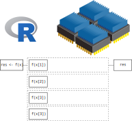

<!--Yeah... I have really long code chunks, so I just changed the default size :)-->
<style type="text/css">
code.r,code.cpp{
  font-size:medium;
}
</style>

# Part I: intro

---

## What is HPC

High Performance Computing (HPC) can relate to any of the following:

- **Parallel computing**, i.e. using multiple resources (could be threads, cores, nodes, etc.) simultaneously to complete a task.

- **Big data** working with large datasets (in/out-of-memory).

We will mostly focus on parallel computing.

---

## Serial computation

<div align="center">
<figure>

<figcaption>Here we are using a single core. The function is applied one element at a time, leaving the other 3 cores without usage.</figcaption>
</figure>
</div>

---

## Parallel computation

<div align="center">
<figure>

<figcaption>In this more intelligent way of computation, we are taking full advantage of our computer by using all 4 cores at the same time. This will reduce computation time which, in the case of complicated/long calculations, can be an important speed gain.</figcaption>
</figure>
</div>


---

## Parallel computing: Hardware

When it comes to parallel computing, there are several ways (levels) in which we can speed up our analysis. From the bottom up:

- **[Thread level SIMD instructions](https://en.wikipedia.org/wiki/Vector_processor)**: Most modern processors support some level of what is called vectorization, this is, applying a single (same) instruction to streams of data. For example: adding vector `A` and `B`.

- **[Hyper-Threading Technology](https://en.wikipedia.org/wiki/Hyper-threading)** (HTT): Intel's hyper-threading generates a virtual partition of a single core (processor) which, while not equivalent to having multiple physical threads, does speed things up.

- **[Multi-core processor](https://en.wikipedia.org/wiki/Multi-core_processor)**: Most modern CPUs (Central Processing Unit) have two or more physical cores. A typical laptop computer has about 8 cores.

- **[General-Purpose Computing on Graphics Processing Unit](https://en.wikipedia.org/wiki/General-purpose_computing_on_graphics_processing_units)** (GP-GPU): While modern CPUs have multiple cores, GPUs can hold thousands of cores. Designed for image processing, there's an increasing use of GPUs as an alternative to CPUs for scientific computing.

- **[High-Performance Computing Cluster](https://en.wikipedia.org/wiki/Computer_cluster)** (HPC): A collection of computing nodes that are interconnected using a fast Ethernet network.

- **[Grid Computing](https://en.wikipedia.org/wiki/Grid_computing)**: A collection of loosely interconnected machines that may or may not be in the same physical place, for example: HTCondor clusters. 

---

## Parallel computing: CPU components

<div align="center">
<figure>

<figcaption>Taxonomy of CPUs (Downloaded from <a href="https://slurm.schedmd.com/mc_support.html">https://slurm.schedmd.com/mc_support.html</a>)</figcaption>
</figure>
</div>

---

<div align="center">
<figure>

<figcaption>Ask yourself these questions before jumping into HPC!</figcaption>
</figure>
</div>

---

## Parallel computing in R

While there are several alternatives (just take a look at the
[High-Performance Computing Task View](https://cran.r-project.org/web/views/HighPerformanceComputing.html)),
we'll focus on the following R-packages for **explicit parallelism**

Some examples:

> *   [**parallel**](https://cran.r-project.org/package=parallel): R package that provides '[s]upport for parallel computation,
    including random-number generation'.

> *   [**foreach**](https://cran.r-project.org/package=foreach): R package for 'general iteration over elements' in parallel fashion.

> *   [**future**](https://cran.r-project.org/package=future): '[A] lightweight and
    unified Future API for sequential and parallel processing of R
    expression via futures.' (won't cover here)
    
Implicit parallelism, on the other hand, are out-of-the-box tools that allow the
programmer not to worry about parallelization, e.g. such as
[**gpuR**](https://cran.r-project.org/package=gpuR) for Matrix manipulation using
GPU, [**tensorflow**](https://cran.r-project.org/package=tensorflow)

---

And there's also a more advanced set of options

> *   [**Rcpp**](https://cran.r-project.org/package=Rcpp) + [OpenMP](https://www.openmp.org):
    [Rcpp](https://cran.r-project.org/package=Rcpp) is an R package for integrating
    R with C++, and OpenMP is a library for high-level parallelism for C/C++ and
    Fortran.

> *   A ton of other type of resources, notably the tools for working with 
    batch schedulers such as Slurm, HTCondor, etc.
   
---
    
## The {parallel} package

*  Based on the `snow` and `multicore` R Packages.

*  Explicit parallelism.

*  Simple yet powerful idea: Parallel computing as multiple R sessions.

*  Clusters can be made of both local and remote sessions

*  Multiple types of cluster: `PSOCK`, `Fork`, `MPI`, etc.

<div style="text-align: center;"></div>

---

# Parallel workflow

(Usually) We do the following:

1.  Create a `PSOCK/FORK` (or other) cluster using `makePSOCKCluster`/`makeForkCluster`
    (or simply `makeCluster`)
    
2.  Copy/prepare each R session (if you are using a `PSOCK` cluster):

    a.  Copy objects with `clusterExport`

    b.  Set a seed with `clusterSetRNGStream`

3.  Do your call:

    a.  Pass expressions with `clusterEvalQ`
    
    b.  Run a parallelized loop with `parApply`, `parLapply`, etc.

4.  Stop the cluster with `clusterStop`

---

## Ex 1: Hello world!

```{r parallel-ex-psock, echo=TRUE, cache=TRUE}
# 1. CREATING A CLUSTER
library(parallel)
cl <- makeCluster(4)    
x  <- 20

# 2. PREPARING THE CLUSTER
clusterSetRNGStream(cl, 123) # Equivalent to `set.seed(123)` (not necessary for this example)
clusterExport(cl, "x")

# 3. DO YOUR CALL
clusterEvalQ(cl, {
  paste0("Hello from process #", Sys.getpid(), ". I see x and it is equal to ", x)
})

# 4. STOP THE CLUSTER
stopCluster(cl)
```

---

## Ex 1: Hello world! (redux)

Multi-core versions of the `*apply` functions are simpler, but may not work on Windows machines.

```{r parallel-ex-mclap, echo=TRUE, cache=TRUE}
# 1. SETUP
library(parallel)
x  <- 20

# 2. DO YOUR CALL
mclapply(1:4, function(i){
    paste0("Hello from process #", Sys.getpid(), ". I see x and it is equal to ", x)
}, mc.cores = 4)
```

---

## Ex 2: Parallel regressions

**Problem**: Run multiple regressions on a very wide dataset. We need to fit the following model:

$$
y = X_i\beta_i + \varepsilon,\quad \varepsilon\sim N(0, \sigma^2_i),\quad\forall i
$$

```{r lots-of-lm-dgp, echo=FALSE}
set.seed(131)
y <- rnorm(500)
X <- matrix(rnorm(500*999), nrow = 500, dimnames = list(1:500, sprintf("x%03d", 1:999)))
```

```{r lots-of-lm-print}
dim(X)
X[1:6, 1:5]
str(y)
```

---

## Ex 2: Parallel regressions (cont'd 1)

**Serial solution**: Use `apply` (basic loop) to solve it

```{r lots-of-lm-serial, cache = FALSE, strip.white=FALSE}
#
#
#
ans <- apply(
  X = X,
  MARGIN = 2,
  FUN = function(x) coef(lm(y ~ x))
)

ans[,1:5]
```

---

## Ex 2: Parallel regressions (cont'd 2)

**Parallel solution**: Use `parApply`

```{r lots-of-lm-parallel, cache = FALSE}
library(parallel)
cl <- makeCluster(4L)
clusterExport(cl, "y")
ans <- parApply(
  cl = cl,
  X = X,
  MARGIN = 2,
  FUN = function(x) coef(lm(y ~ x))
)
 
ans[,1:5]
```

---

## Ex 2: Parallel regressions (cont'd 3)

Are we going any faster?

```{r lots-of-lm-benchmark, cache = TRUE, warning=FALSE, dependson=-1}
microbenchmark::microbenchmark(
  parallel = parApply(
    cl = cl,
    X = X, MARGIN = 2,
    FUN = function(x) coef(lm(y ~ x))
  ),
  serial = apply(
    X = X, MARGIN = 2,
    FUN = function(x) coef(lm(y ~ x))
  ), unit="relative"
)
```

```{r lots-of-lm-stopcluster, cache = TRUE, echo=FALSE}
stopCluster(cl)
```

---

# Part II: Extended Example

---

## Extended Example: SARS-CoV2 simulation

An altered version of [Conway's game of life](https://en.wikipedia.org/wiki/Conway's_Game_of_Life)

1. People live on a grid, each individual having 8 neighbors.

2. A healthy individual (A) interacting with a sick neighbor (B) has the following probabilities of contracting the disease:

   a. 100% if neither wears a mask.
   
   b. 50% if only A wears a mask.
   
   c. 20% if only B wears a mask.
   
   d. 5% if both wear masks.
    
4. Infected individuals may die with probability 10%.
  
We want to illustrate the importance of wearing face masks. We are going to simulate a system with 2,500 (50 x 50) individuals, 1,000 times so we can analyze: (a) contagion curve, (b) death curve.

More models like this: The [SIRD model](https://en.wikipedia.org/wiki/Compartmental_models_in_epidemiology#The_SIRD_model) (Susceptible-Infected-Recovered-Deceased)

---

## Conway's Game of Masks

Download the program [here](sars-cov2.R).

```{r covid-program, echo = TRUE, eval=TRUE}
source("~/Downloads/sars-cov2.R", echo=FALSE)

# Looking at some constants
probs_sick # Sick individual's probabilities
probs_susc # Probabilities of i getting the disease 
```

---

## First look: What does the simulation look like?

```{r first-look}
set.seed(7123)
one <- simulate_covid(
    pop_size = 1600,
    nsick = 160,
    nwears_mask = 1:400,
    nsteps = 20,
    store = TRUE
)

one$statistics[c(1:5, 16:20),]
```

---

## First look: What does the simulation look like? (contd')

```{r covid-animation, eval=FALSE, echo=TRUE}
# Location of who wears the facemask. This step is only for plotting
wears <- which(one$wears, arr.ind = TRUE) - 1
wears <- wears/(one$nr) * (1 + 1/one$nr)

# Initializing the animation
fig   <- magick::image_device(600, 600, res = 96/2, pointsize = 24)
for (i in 1:one$current_step) {
  
  # Plot
  image(
    one$temporal[,,i], col=c("gray", "tomato", "steelblue","black"),
    main = paste("Time", i - 1L, "of", one$nsteps),
    zlim = c(1,4)
    )
  points(wears, col="white", pch=20, cex=1.5)
  legend(
    "topright",
    col = c("gray", "tomato", "steelblue","black", "black"),
    legend = c(names(codes), "wears a mask"),
    pch = c(rep(15, 4), 21)
  )
}

# Finalizing plot and writing the animation
dev.off()
animation <- magick::image_animate(fig, fps = 2)
magick::image_write(animation, "covid1.gif")
```


---

<video controls width="500" height="500">
<source type="video/webm" src="fig/covid1.webm">
</video>

---

```{r sim-nobody-wears-mask, cache=TRUE, eval=TRUE}
set.seed(123355)
stats_nobody_wears_masks <- replicate(50, {
  simulate_covid(
    pop_size    = 900,
    nsick       = 10,
    nwears_mask = 0,
    nsteps      = 15)$statistics[,"deceased"]
  }, simplify = FALSE
  )

set.seed(123355)
stats_half_wears_masks <- replicate(50, {
  simulate_covid(
    pop_size    = 900,
    nsick       = 10,
    nwears_mask = 450,
    nsteps      = 15)$statistics[,"deceased"]
  }, simplify = FALSE
  )

set.seed(123355)
stats_all_wears_masks <- replicate(50, {
  simulate_covid(
    pop_size    = 900,
    nsick       = 10,
    nwears_mask = 900,
    nsteps      = 15)$statistics[,"deceased"]
  }, simplify = FALSE
  )
```

---

```{r boxplot, fig.width=6, fig.height=6, echo=FALSE, fig.align='center', fig.cap="Cumulative number of deceased as a function of whether none, half, or all individuals wear a face mask.", dev='svg'}
stats_nobody_wears_masks <- do.call(rbind, stats_nobody_wears_masks)
stats_half_wears_masks <- do.call(rbind, stats_half_wears_masks)
stats_all_wears_masks <- do.call(rbind, stats_all_wears_masks)

boxplot(stats_nobody_wears_masks, col = "tomato",
        ylab = "Cumulative Deaths", xlab = "Step")
boxplot(stats_half_wears_masks, add = TRUE, col = "gray")
boxplot(stats_all_wears_masks, add = TRUE, col = "steelblue")
legend(
  "topleft",
  fill = c("tomato", "gray", "steelblue"),
  title = "Wears mask:",
  legend = c("Nobody","Half","Everybody"),
)
```

---

## Speed things up: Timing under the serial implementation

We will use the function `system.time` to measure how much time it takes to complete 20 simulations in serial versus parallel fashion using 4 cores.

```{r timing1, cache=TRUE}
time_serial <- system.time({
  ans_serial <- replicate(50, {
    simulate_covid(
      pop_size = 900,
      nsick = 10,
      nwears_mask = 900,
      nsteps = 20)$statistics[,"deceased"]
    },
    simplify = FALSE
    )
})
```

---

## Speed things up: Parallel a Forking Cluster

Alternative 1: If you are using Unix-like system (Ubuntu, OSX, etc.), you can take advantage of process forking, and thus, parallel's `mclapply` function:

```{r timing-mclapply, cache=TRUE}
set.seed(1231)
time_parallel_fork <- system.time({
  ans_parallel <- parallel::mclapply(1:50, function(i) {
    simulate_covid(
      pop_size = 900,
      nsick = 10,
      nwears_mask = 900,
      nsteps = 20)$statistics[,"deceased"]
    }, mc.cores = 2L
  )
})
```

---

## Speed things up: Parallel with a Socket Cluster


Alternative 2: Regardless of the operating system, we can use a Socket cluster, which is simply a group of fresh R sessions that listen to the parent/main/mother session.

```{r}
# Step 1: Make the cluster
cl <- parallel::makePSOCKcluster(2L)
```

```r
# Step 2: Prepare the cluster
# We could either export all the needed variables
parallel::clusterExport(
  cl,
  c("calc_stats", "codes", "dat", "get_neighbors", "init", "probs_sick",
    "probs_susc", "simulate_covid", "update_status", "update_status_all"
    )
  )
```

Or simply running the simulation script in the other sessions

```{r parallel-sourcing, echo = TRUE, results='hide'}
# Step 2 (alt): Prepare the cluster
parallel::clusterEvalQ(cl, source("sars-cov2.R"))
parallel::clusterSetRNGStream(cl, 123) # Make sure it is reproducible!
```

---

Bonus: Checking what are the processes running on the system

```r
(pids <- c(
  master    = Sys.getpid(),
  offspring = unlist(parallel::clusterEvalQ(cl, Sys.getpid()))
  ))
#      master offspring1 offspring2 
#     14810      15998      16012 
```

If you are using Unix, you can see more details:


---

## Speed things up: Parallel with a Socket Cluster (cont'd)

```{r timing-parlapply, cache=TRUE}
# Step 3: Do your call
time_parallel_sock <- system.time({
  ans_parallel <- parallel::parLapply(cl, 1:50, function(i) {
    simulate_covid(
      pop_size    = 900,
      nsick       = 10,
      nwears_mask = 900,
      nsteps      = 20)$statistics[,"deceased"]
    }
  )
})

# Step 4: Stop
parallel::stopCluster(cl)
```

---

Using two threads/processes, you can obtain the following speedup

```{r}
time_serial
```

```{r}
time_parallel_sock
```

```{r}
time_parallel_fork
```

---

# Part III: Cloud Computing

---

## Cloud Computing (a.k.a. on-demand computing)

HPC clusters, super-computers, etc. need not be bought... you can rent:

- [Amazon Web Services (AWS)](https://aws.amazon.com)

- [Google Cloud Computing](https://cloud.google.com)

- [Microsoft Azure](https://azure.microsoft.com)

These services provide more than just computing (storage, data analysis, etc.). But for computing and storage, there are other free resources, e.g.:

- [The  Extreme Science and Engineering Discovery Environment (XSEDE)](https://www.xsede.org/)

---

## There are many ways to run R in the cloud

At USC:

- Center for Advanced Research Computing (CARC). USC users can request hundreds
  of cores (literally).

Running R in:

- Google Cloud: https://cloud.google.com/solutions/running-r-at-scale
- Amazon Web Services: https://aws.amazon.com/blogs/big-data/running-r-on-aws/
- Microsoft Azure: https://docs.microsoft.com/en-us/azure/architecture/data-guide/technology-choices/r-developers-guide

---

## Submitting jobs

- A key feature of cloud services: interact via command line.

- You will need to be familiar with `Rscript` and `R CMD BATCH`.

- Which is better? It depends on the application.

---

## Submitting jobs (examples)

Imagine we have the following R script (download [here](dummy.R)):

```r
library(data.table)
set.seed(1231)
dat <- data.table(y = rnorm(1e3), x = sample.int(5, 1e3, TRUE))
dat[,mean(y), by = x]
```

**R CMD BATCH**

This will run a non-interactive R session and put all the output
([stdout](https://wikipedia.org/wiki/stdout) and [stderr](https://wikipedia.org/wiki/stderr)) to the file `dummy.Rout`.

```
R CMD BATCH --vanilla dummy.R dummy.Rout &
```

**Rscript**

This will also execute R in the background, with the difference that
the output `dummy.Rout` will not capture `stderr` (messages, warnings and errors from R).

```
Rscript --vanilla dummy.R > dummy.Rout &
```

The `&` at the end makes sure the job is submitted and does not wait for it to end.

---

## Rscript

The R script can be executed as a program directly, if you specify where the `Rscript` program lives.

The following example works on Unix. This is an R script named `since_born.R`
(download [here](since_born.R))

```bash
#!/usr/bin/Rscript
args <- tail(commandArgs(), 0)
message(Sys.Date() - as.Date(args), " days since you were born.")
```

This R script can be executed in various ways...

---

## Rscript as a program

For this we would need to change it to an executable. In unix you can use the
[chmod](https://wikipedia.org/wiki/chmod) command: `chmod +x since_born.R`. This allows us to do the following:

```{bash since-born, eval=FALSE}
./since_born.R 1988-03-02
```

---

## Rscript in a bash script (most common)

In the case of running jobs on a cluster or something similar, we usually need to have a bash script. In our case, we have a file named `since_born_bash.sh` that calls `Rscript` (download [here](since_born_bash.sh))

```bash
#!/bin/bash
Rscript since_born.R 1988-03-02
```
Which we would execute like this:

```{bash since-born2}
sh since_born_bash.sh
```


---

# Summary

- Parallel computing can speed things up.

- It's not always needed... make sure that you are taking advantage of vectorization.

- Most loops can be parallelized ("embarrassingly parallel computing").

- In R, explicit parallelism can be achieved using the **parallel** package:

    1. Load the package and create a cluster: **library(parallel)**, **parallel::makeCluster()**
    
    2. Setup the environment: **parallel::clusterExport()**, **parallel::clusterSetRNGStream()**
    
    3. Make the call: **parallel::clusterEvalQ()**, **parallel::parLapply()**
    
    4. Stop the cluster: **parallel::stopCluster()**
    
- Regardless of the Cloud computing service we are using, we will be
using either `R CMD BATCH` or `Rscript` to submit jobs.

---

## Session info

```{r session, echo=FALSE}
sessionInfo()
```

---

## (Bonus) Rcpp: Hello world!

### The Fibonacci series


$$
Fib(n) = \left\{\begin{array}{ll}
n & \mbox{if }n \leq 1 \\ 
Fib(n-1) + Fib(n - 2) & \mbox{otherwise}
\end{array}\right.
$$

---

## Rcpp: Hello world! v1

The following C++ file, called `fib.cpp`

```{Rcpp fib-cpp-program, cache=TRUE}
#include <Rcpp.h>

// [[Rcpp::export]]
int fibCpp(int n) {
  
  if (n < 2) {
    return n;
  }
  
  return fibCpp(n - 1) + fibCpp(n - 2);
  
}
```

Can be compiled within R using `Rcpp::sourceCpp("fib.cpp")`. This exports the function back into R

```{r fib-in-r}
c(fibCpp(1), fibCpp(2), fibCpp(3), fibCpp(4), fibCpp(5))
```

---

## Rcpp: Hello world! v2 (with function overloading) 

Rcpp data types are mapped directly to R data types, e.g. vectors of integers in R can be used as `IntegerVector` in Rcpp.

```{Rcpp fib-cpp-program2, cache=TRUE}
#include <Rcpp.h>

using namespace Rcpp;

// inline kind of implementation
int fibCpp(int n) {return (n < 2)? n : fibCpp(n - 1) + fibCpp(n - 2);}

// [[Rcpp::export]]
IntegerVector fibCpp(IntegerVector n) {

  IntegerVector res(n.size());
  for (int i = 0; i < n.size(); ++i)
    res[i] = fibCpp(n[i]);
    
  return res;
  
}
```

Back in R

```{r fib-in-r2}
fibCpp(1:5)
```

---

## RcppArmadillo and OpenMP

*   Friendlier than [**RcppParallel**](http://rcppcore.github.io/RcppParallel/)...
    at least for 'I-use-Rcpp-but-don't-actually-know-much-about-C++' users (like myself!).

*   Must run only 'Thread-safe' calls, so calling R within parallel blocks can cause problems (almost all the time).
    
*   Use `arma` objects, e.g. `arma::mat`, `arma::vec`, etc. Or, if you are used to them `std::vector` objects as these are thread safe.

*   Pseudo-Random Number Generation is not very straight forward... But C++11 has a [nice set of functions](http://en.cppreference.com/w/cpp/numeric/random) that can be used together with OpenMP

*   Need to think about how processors work, cache memory, etc. Otherwise you could get into trouble... if your code is slower when run in parallel, then you probably are facing [false sharing](https://software.intel.com/en-us/articles/avoiding-and-identifying-false-sharing-among-threads)
    
*   If R crashes... try running R with a debugger (see [Section 4.3 in Writing R extensions](https://cran.r-project.org/doc/manuals/r-release/R-exts.html#Checking-memory-access)):
    
    ```shell
    ~$ R --debugger=valgrind
    ```
---

## RcppArmadillo and OpenMP workflow

1.  Add the following to your C++ source code to use OpenMP, and tell Rcpp that you need to include that in the compiler:
    
    ```cpp
    #include <omp.h>
    // [[Rcpp::plugins(openmp)]]
    ```

2.  Tell the compiler that you'll be running a block in parallel with openmp
    
    ```cpp
    #pragma omp [directives] [options]
    {
      ...your neat parallel code...
    }
    ```
    
    You'll need to specify how OMP should handle the data:
    
    *   `shared`: Default, all threads access the same copy.
    *   `private`: Each thread has its own copy (although not initialized).
    *   `firstprivate` Each thread has its own copy initialized.
    *   `lastprivate` Each thread has its own copy. The last value is the one stored in the main program.
    
    Setting `default(none)` is a good practice.
    
3.  Compile!

---

## Ex 3: RcppArmadillo + OpenMP

Computing the distance matrix (see `?dist`)

```{Rcpp dist-code, cache=TRUE, echo=TRUE, eval=FALSE}
#include <Rcpp.h>
#include <omp.h>
#include <RcppArmadillo.h>
// [[Rcpp::depends(RcppArmadillo)]]
// [[Rcpp::plugins(openmp)]]
using namespace Rcpp;

// [[Rcpp::export]]
arma::mat dist_par(const arma::mat & X, int cores = 1) {
  
  // Some constants and the result
  int N = (int) X.n_rows; int K = (int) X.n_cols;
  arma::mat D(N,N,arma::fill::zeros);
  
  omp_set_num_threads(cores); // Setting the cores
  
#pragma omp parallel for shared(D, N, K, X) default(none)
  for (int i=0; i<N; ++i)
    for (int j=0; j<i; ++j) {
      for (int k=0; k<K; k++) 
        D.at(i,j) += pow(X.at(i,k) - X.at(j,k), 2.0);
      
      // Computing square root
      D.at(i,j) = sqrt(D.at(i,j)); D.at(j,i) = D.at(i,j);
    }
      
  // My nice distance matrix
  return D;
}
```

---

```{r dist-dgp, echo=TRUE, cache=TRUE}
set.seed(1231)
K <- 1000
n <- 500
x <- matrix(rnorm(n*K), ncol=K)
```

```{r dist-benchmark, echo=TRUE, cache=TRUE, eval=FALSE}
# Benchmarking!
microbenchmark::microbenchmark(
  dist(x),                 # stats::dist
  dist_par(x, cores = 1),  # 1 core
  dist_par(x, cores = 2),  # 2 cores
  times = 10, unit="relative"
)
```

---

## Resources

*   [Package parallel](https://stat.ethz.ch/R-manual/R-devel/library/parallel/doc/parallel.pdf) 
*   [Using the iterators package](https://cran.r-project.org/web/packages/iterators/vignettes/iterators.pdf)
*   [Using the foreach package](https://cran.r-project.org/web/packages/foreach/vignettes/foreach.pdf)
*   [32 OpenMP traps for C++ developers](https://software.intel.com/en-us/articles/32-openmp-traps-for-c-developers)
*   [The OpenMP API specification for parallel programming](http://www.openmp.org/)
*   ['openmp' tag in Rcpp gallery](gallery.rcpp.org/tags/openmp/)
*   [OpenMP tutorials and articles](http://www.openmp.org/resources/tutorials-articles/)

For more, checkout the [CRAN Task View on HPC](https://cran.r-project.org/web/views/HighPerformanceComputing.html){target="_blank"}

---

## Simulating $\pi$


*   We know that $\pi = \frac{A}{r^2}$. We approximate it by randomly adding points $x$ to a square of size 2 centered at the origin.

*   So, we approximate $\pi$ as $\Pr\{\|x\| \leq 1\}\times 2^2$

```{r, echo=FALSE, dev='jpeg', dev.args=list(quality=100), fig.width=6, fig.height=6, out.width='300px', out.height='300px'}
set.seed(1231)
p <- matrix(runif(5e3*2, -1, 1), ncol=2)
pcol <- ifelse(sqrt(rowSums(p^2)) <= 1, adjustcolor("blue", .7), adjustcolor("gray", .7))
plot(p, col=pcol, pch=18)
```

---

The R code to do this

```{r simpi, echo=TRUE}
pisim <- function(i, nsim) {  # Notice we don't use the -i-
  # Random points
  ans  <- matrix(runif(nsim*2), ncol=2)
  
  # Distance to the origin
  ans  <- sqrt(rowSums(ans^2))
  
  # Estimated pi
  (sum(ans <= 1)*4)/nsim
}
```

---

```{r parallel-ex2, echo=TRUE, cache=TRUE}
library(parallel)
# Setup
cl <- makeCluster(4L)
clusterSetRNGStream(cl, 123)

# Number of simulations we want each time to run
nsim <- 1e5

# We need to make -nsim- and -pisim- available to the
# cluster
clusterExport(cl, c("nsim", "pisim"))

# Benchmarking: parSapply and sapply will run this simulation
# a hundred times each, so at the end we have 1e5*100 points
# to approximate pi
microbenchmark::microbenchmark(
  parallel = parSapply(cl, 1:100, pisim, nsim=nsim),
  serial   = sapply(1:100, pisim, nsim=nsim), times = 1, unit="relative"
)

```

---

## (Bonus) Overview of HPC

Using [Flynn's classical taxonomy](https://en.wikipedia.org/wiki/Flynn%27s_taxonomy), we can classify parallel computing according to the following two dimensions:

a. Type of instruction: Single vs Multiple

b. Data stream: Single vs Multiple

<figure>


<figcaption><a href="https://en.wikipedia.org/wiki/Michael_J._Flynn" target="_blank">Michael Flynn</a>'s Taxonomy (<a href="https://en.wikipedia.org/wiki/Flynn%27s_taxonomy" target="_blank">wiki</a>)</figcaption>
</figure>

---

## (Bonus) Parallel computing: Software

Implicit parallelization:

- [tensorflow](https://en.wikipedia.org/wiki/TensorFlow): Machine learning framework
- [pqR](http://www.pqr-project.org/): Branched version of R.
- [Microsoft R](https://mran.microsoft.com/open): Microsoft's R private version (based on Revolution Analytics' R version).
- [data.table](https://cran.r-project.org/package=data.table) (R package): Data wrangling using multiple cores.
- [caret](https://cran.r-project.org/package=caret) (R package): A meta package, has various implementations using parallel computing.

Explicit parallelization ([DIY](https://en.wikipedia.org/wiki/Do_it_yourself)):

- [CUDA](https://en.wikipedia.org/wiki/CUDA) (C/C++ library): Programming with GP-GPUs.
- [Open MP](https://openmp.org) (C/C++ library): Multi-core programming (CPUs).
- [Open MPI](https://open-mpi.org) (C/C++ library): Large scale programming with multi-node systems.
- [Threading Building Blocks](https://en.wikipedia.org/wiki/Threading_Building_Blocks) (C/C++ library): Intel's parallel computing library.
- [Kokkos](https://kokkos.org/about/) (C++ library): A hardware-agnostic programming framework for HPC applications.
- [parallel](https://CRAN.R-project.org/view=HighPerformanceComputing) (R package): R's built-in parallel computing package
- [future](https://cran.r-project.org/package=future) (R package): Framework for parallelzing R.
- [RcppParallel](https://cran.r-project.org/package=RcppParallel) (R C++ API wrapper): Header and templates for building [Rcpp](https://cran.r-project.org/package=Rcpp)+multi-threaded programs.
- [julia](https://julialang.org) (programming language): High-performing, has a framework for parallel computing as well.
