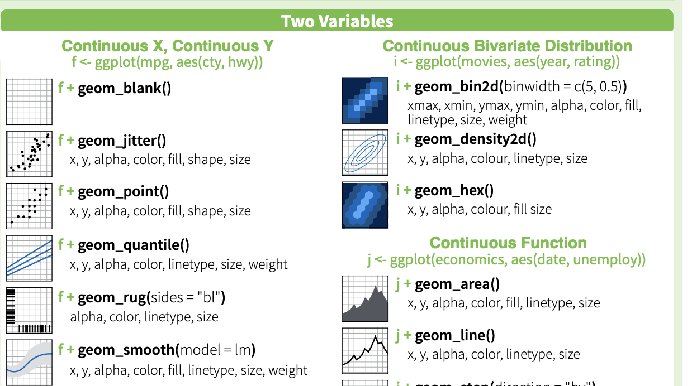

```{r include=FALSE}
library(knitr)
hook_output <- knit_hooks$get("output")
knit_hooks$set(output = function(x, options) {
  lines <- options$output.lines
  if (is.null(lines)) {
    return(hook_output(x, options))  # pass to default hook
  }
  x <- unlist(strsplit(x, "\n"))
  more <- "..."
  if (length(lines) == 1) {        # first n lines
    if (length(x) > lines) {
      # truncate the output, but add ....
      x <- c(head(x, lines), more)
    }
  } else {
    x <- c(more, x[lines], more)
  }
  # paste these lines together
  x <- paste(c(x, ""), collapse = "\n")
  hook_output(x, options)
})
knit_hooks$set(output = function(x, options) {
  # this hook is used only when the linewidth option is not NULL
  if (!is.null(n <- options$linewidth)) {
    x = knitr:::split_lines(x)
    # any lines wider than n should be wrapped
    if (any(nchar(x) > n)) x = strwrap(x, width = n)
    x = paste(x, collapse = '\n')
  }
  hook_output(x, options)
})

opts_chunk$set(
  echo = TRUE,
  fig.width = 7, 
  fig.align = 'center',
  fig.asp = 0.618, # 1 / phi
  out.width = "700px")
```

```{r, echo = FALSE}
library(sass)
sass(sass_file("theme.sass"), output = "theme.css")
```

# What is this lecture?

```{r, out.width='25%', echo=FALSE}
knitr::include_graphics("img/ggplot2.png")
```

This lecture provides an introduction to ggplot2, an R package that provides vastly better graphics options than R's default plots, histrograms, etc.

This section is based on chapter 3 of  ["R for Data Science"](https://r4ds.had.co.nz/)

---


## Background

`ggplot2` is part of the Tidyverse. The tidyverse is..."an opinionated collection of R packages designed for data science. All packages share an underlying design philosophy, grammar, and data structures." (https://www.tidyverse.org/)

```{r , results='hide',message=FALSE}
library(tidyverse)
```
---

## ggplot

* With ggplot2 a plot is initiated with the function `ggplot()`
* The first argument of `ggplot()` is the dataset to use in the graph
* Layers are added to `ggplot()` with `+`
* Layers include `geom` functions such as point, lines, etc
* Each `geom` function takes a `mapping` argument, which is always paired with `aes()`
* The `aes()` mapping takes the x and y axes of the plot

```{r , eval=FALSE,message=FALSE}
ggplot(data=data) +
    geom_function(mapping=aes(mappings))
```
---

## Data
Here is a data frame that is part of ggplot2:
```{r}
mpg
head(mpg)
```
The variables we will focus on for this example are

* displ, a car???s engine size, in litres.
* hwy, a car???s fuel efficiency on the highway, in miles per gallon (mpg). 

---

## Basic plot 1

Here's how to create a basic plot in ggplot2

```{r, out.width='40%'}
ggplot(data = mpg) + 
  geom_point(mapping = aes(x = displ, y = hwy))
```
As expected, we see that cars with big engines use more fuel.

ggplot2 begins a plot with the function ggplot(), which creates a coordinate system that you can add layers to. The first argument of ggplot() is the dataset to use in the graph.

You complete the graph by adding one or more layers to ggplot().

---

### Basic plot 2

geom_point() adds a layer of points to your plot, to create a scatterplot. 

ggplot2 comes with many geom functions that each add a different type of layer to a plot. 

Each geom function in ggplot2 takes a mapping argument. 
This defines how variables in your dataset are mapped to visual properties. 
The mapping argument is always paired with aes(), and the x and y arguments of aes() specify which variables to map to the x and y axes. ggplot2 looks for the mapped variables in the data argument, in this case, mpg.

One common problem when creating ggplot2 graphics is to put the + in the wrong place: it has to come at the end of the line, not the start.

---
### Coloring by a variable - using aesthetics

You can convey information about your data by mapping the aesthetics in your plot to the variables in your dataset. For example, you can map the colors of your points to the class variable to reveal the class of each car. ggpot chooses colors, and adds a legend, automatically.
```{r, out.width='50%'}
ggplot(data = mpg) + 
  geom_point(mapping = aes(x = displ, y = hwy, color = class))
```
We see that 2-seater cars have small engines and unusally high fuel efficiency.

---
### Determining point size using a variable 
You can map point size to a variable as well:
```{r, out.width='50%'}
ggplot(data = mpg) + 
  geom_point(mapping = aes(x = displ, y = hwy, size = class))
```
---

### Controlling point transparency using the "alpha" aesthetic
```{r, out.width='50%'}
ggplot(data = mpg) + 
  geom_point(mapping = aes(x = displ, y = hwy, alpha = class))
```

---

### Controlling point shape:
```{r, out.width='50%'}
ggplot(data = mpg) + 
  geom_point(mapping = aes(x = displ, y = hwy, shape = class))
``` 
 Note that, by default, ggplot uses up to 6 shapes. If there are more, some of your data is not plotted!! (At least it warns you.)

---

### Manual control of aesthetics

To control aesthetics manually, set the aesthetic by name as an argument of your geom function; i.e. it goes outside of aes().
```{r, out.width='50%'}
ggplot(data = mpg) + 
  geom_point(mapping = aes(x = displ, y = hwy), color = "blue")
```
  

---

### Summary of aesthetics
The various aesthetics...

```{r table2, echo=FALSE, message=FALSE, warnings=FALSE, results='asis', eval=FALSE}
tabl <- " 
|code         |         description       | 
|-------------|:-------------------------:|
|     x       |     position on x-axis    |
|     y       |     position on y-axis    |
|   shape     |           shape           |
|   color     |  color of element borders |
|    fill     |  color inside of elements |
|    size     |           size            |
|   alpha     |       transparency        |
|  linetype   |       type of line        |
"
cat(tabl) # output the table in a format good for HTML/PDF/docx conversion
```

---


|code         |         description       | 
|-------------|:-------------------------:|
|     x       |     position on x-axis    |
|     y       |     position on y-axis    |
|   shape     |           shape           |
|   color     |  color of element borders |
|    fill     |  color inside of elements |
|    size     |           size            |
|   alpha     |       transparency        |
|  linetype   |       type of line        |

### Facets 1

Facets are particularly useful for categorical variables...

```{r, out.width='70%'}
ggplot(data = mpg) + 
  geom_point(mapping = aes(x = displ, y = hwy)) + 
  facet_wrap(~ class, nrow = 2)
```
  
---

### Facets 2
Or you can facet on two variables...
```{r, out.width='70%'}
ggplot(data = mpg) + 
  geom_point(mapping = aes(x = displ, y = hwy)) + 
  facet_grid(drv ~ cyl)
```

---

### Geometric objects 1

Geometric objects are used to control the type of plot you draw.
So far we have used scatterplots (via 'geom_point'). But now let's try plotting a smoothed line fitted to the data (and note how we do side-by-side plots)

```{r, message=FALSE, out.width='70%'}
library(cowplot)
scatterplot <- ggplot(data = mpg) + geom_point(mapping = aes(x = displ, y = hwy))
lineplot <- ggplot(data = mpg) + geom_smooth(mapping = aes(x = displ, y = hwy))
plot_grid(scatterplot, lineplot, labels = "AUTO")
```
cowplot is a package due to Claus Wilke, it..." is a simple add-on to ggplot. It provides various features that help with creating publication-quality figures, such as a set of themes, functions to align plots and arrange them into complex compound figures, and functions that make it easy to annotate plots and or mix plots with images."

---

### Geometric objects 2

Note that not every aesthetic works with every geom function. But now there are some new ones we can use. 
```{r}
ggplot(data = mpg) + 
  geom_smooth(mapping = aes(x = displ, y = hwy, linetype = drv))
```
Here we make the line type depend on the cars drivetrain.


---

### Geoms - reference

ggplot2 provides over 40 geoms, and extension packages provide even more (see https://ggplot2.tidyverse.org/reference/ for a sampling). 

The best way to get a comprehensive overview is the ggplot2 cheatsheet, which you can find at https://rstudio.com/wp-content/uploads/2015/03/ggplot2-cheatsheet.pdf

```{r, out.width='75%', echo=FALSE}

```

---

### Multiple geoms 1
To display multiple geoms in the same plot, add multiple geom functions to ggplot():

```{r}
ggplot(data = mpg) + 
  geom_point(mapping = aes(x = displ, y = hwy)) +
  geom_smooth(mapping = aes(x = displ, y = hwy))
```

---

### Multiple geoms 2
We can avoid repetition of aethetics by passing a set of mappings to ggplot(). 
ggplot2 will treat these mappings as global mappings that apply to each geom in the graph. 

```{r}
ggplot(data = mpg, mapping = aes(x = displ, y = hwy)) +
  geom_point() + 
  geom_smooth()
```


---

### Multiple geoms 3

If you place mappings in a geom function, ggplot2 will use these mappings to extend or overwrite the global mappings for that layer only. This makes it possible to display different aesthetics in different layers.

```{r}
ggplot(data = mpg, mapping = aes(x = displ, y = hwy)) + 
  geom_point(mapping = aes(color = class)) + 
  geom_smooth()
```


---

### Multiple geoms 4

You can use the same idea to specify different data for each layer. Here, our smooth line displays just a subset of the mpg dataset, the subcompact cars. The local data argument in geom_smooth() overrides the global data argument in ggplot() for that layer only.

```{r}
ggplot(data = mpg, mapping = aes(x = displ, y = hwy)) + 
  geom_point(mapping = aes(color = class)) + 
  geom_smooth(data = filter(mpg, class == "subcompact"), se = FALSE)
```

---

### Statistical transformationas - e.g. Bar charts

This example uses the built-in dataset "diamonds".

```{r}
ggplot(data = diamonds) + 
  geom_bar(mapping = aes(x = cut))
```

The algorithm uses a built-in statistical trandformation, called a "stat", to calcluate the counts.

---

# Bar charts 2

You can over-ride the stat a geom uses to construct its plot. e.g., if we want to plpot proportions, rather than counts:

```{r}
ggplot(data = diamonds) + 
  geom_bar(mapping = aes(x = cut, y = stat(prop), group = 1))
```

---

# Coloring barcharts

You can colour a bar chart using either the colour aesthetic, or, more usefully, fill:

```{r}
ggplot(data = diamonds) + 
  geom_bar(mapping = aes(x = cut, colour = cut))
ggplot(data = diamonds) + 
  geom_bar(mapping = aes(x = cut, fill = cut))
```

More interestingly, you can fill by another variable (here, 'clarity')

```{r}
ggplot(data = diamonds) + 
  geom_bar(mapping = aes(x = cut, fill = clarity))
```

position = "dodge" places overlapping objects directly beside one another. This makes it easier to compare individual values.

```{r}
ggplot(data = diamonds) + 
  geom_bar(mapping = aes(x = cut, fill = clarity), position = "dodge")
```


---

### Statistical transformations - another example

You might want to draw greater attention to the statistical transformation in your code. For example, you might use stat_summary(), which summarises the y values for each unique x value, to draw attention to the summary that you???re computing:

```{r}
ggplot(data = diamonds) + 
  stat_summary(
    mapping = aes(x = cut, y = depth),
    fun.min = min,
    fun.max = max,
    fun = median
  )
```


---
 
### Position adjustments
 
An option that can be very useful is position = "jitter".
This adds a small amount of random noise to each point. This spreads out points that might otherwise be overlapping. e.g., 


```{r}
nojitter <- ggplot(data = mpg) + 
  geom_point(mapping = aes(x = displ, y = hwy))
jitter <- ggplot(data = mpg) + 
  geom_point(mapping = aes(x = displ, y = hwy), position = "jitter")

plot_grid(nojitter, jitter, labels = "AUTO")
```

---

### Coordinate systems

Coordinate systems are one of the more complicated corners of ggplot.
To start with something simple, here's how to flip axes:

```{r}
unflipped <- ggplot(data = mpg, mapping = aes(x = class, y = hwy)) + 
  geom_boxplot()
flipped <- ggplot(data = mpg, mapping = aes(x = class, y = hwy)) + 
  geom_boxplot() +
  coord_flip()
plot_grid(unflipped, flipped, labels = "AUTO")
```

There is also the ability to control the aspect ratio using coord_quickmap()  and to use polar coordinates with coord_polar().

```{r}
bar <- ggplot(data = diamonds) + 
  geom_bar(
    mapping = aes(x = cut, fill = cut), 
    show.legend = FALSE,
    width = 1
  ) + 
  theme(aspect.ratio = 1) +
  labs(x = NULL, y = NULL)

bar + coord_flip()
bar + coord_polar()
```

---

### A Great reference

A great (comprehensive) reference for everything you can do with ggplot2 is the R Graphics Cookbook:

https://r-graphics.org/

---

### Reminder - the ggplot2 cheatsheet

A briefer summary can be found here:

https://rstudio.com/wp-content/uploads/2015/03/ggplot2-cheatsheet.pdf

Rstudio has a variety of other great Cheatsheets.

---


---

### Finally, file under "useless but cool"

ggpattern - is a library for adding pattern fills to histograms. e.g.,


---
