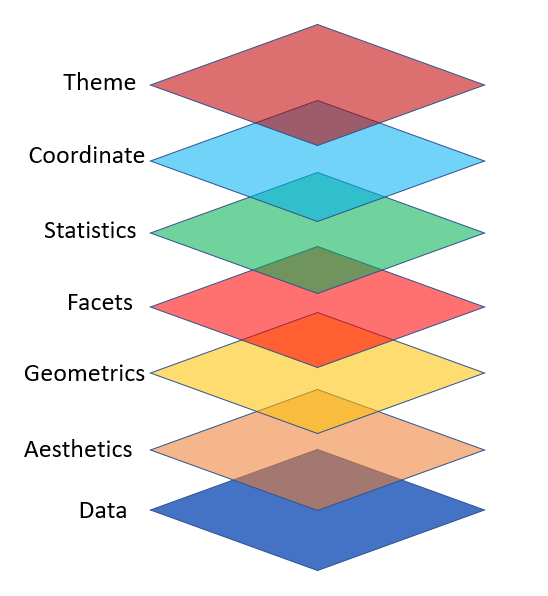

<style type="text/css">
pre{
  font-size:20px;
}
code.r,code.cpp{
  font-size:large
}
</style>

```{r include=FALSE}
library(knitr)
hook_output <- knit_hooks$get("output")
knit_hooks$set(output = function(x, options) {
  lines <- options$output.lines
  if (is.null(lines)) {
    return(hook_output(x, options))  # pass to default hook
  }
  x <- unlist(strsplit(x, "\n"))
  more <- "..."
  if (length(lines) == 1) {        # first n lines
    if (length(x) > lines) {
      # truncate the output, but add ....
      x <- c(head(x, lines), more)
    }
  } else {
    x <- c(more, x[lines], more)
  }
  # paste these lines together
  x <- paste(c(x, ""), collapse = "\n")
  hook_output(x, options)
})
knit_hooks$set(output = function(x, options) {
  # this hook is used only when the linewidth option is not NULL
  if (!is.null(n <- options$linewidth)) {
    x = knitr:::split_lines(x)
    # any lines wider than n should be wrapped
    if (any(nchar(x) > n)) x = strwrap(x, width = n)
    x = paste(x, collapse = '\n')
  }
  hook_output(x, options)
})

opts_chunk$set(
  echo = TRUE,
  fig.width = 7, 
  fig.align = 'center',
  fig.asp = 0.618, # 1 / phi
  out.width = "700px")
```

```{r, echo = FALSE}
library(sass)
sass(sass_file("theme.sass"), output = "theme.css")
```

## Background

```{r, out.width='25%', echo=FALSE}
knitr::include_graphics("img/ggplot2.png")
```

This lecture provides an introduction to ggplot2, an R package that provides vastly better graphics options than R's default plots, histrograms, etc.

This section is based on chapter 3 of  ["R for Data Science"](https://r4ds.had.co.nz/)

---


## Background

`ggplot2` is part of the Tidyverse. The tidyverse is..."an opinionated collection of R packages designed for data science. All packages share an underlying design philosophy, grammar, and data structures." (https://www.tidyverse.org/)

```{r , results='hide',message=FALSE}
library(tidyverse)
```
---

## ggplot2

`ggplot2` is designed on the principle of adding layers.

```{r, out.width='40%', echo=FALSE}

```

---

## ggplot2

* With ggplot2 a plot is initiated with the function `ggplot()`
* The first argument of `ggplot()` is the dataset to use in the graph
* Layers are added to `ggplot()` with `+`
* Layers include `geom` functions such as point, lines, etc
* Each `geom` function takes a `mapping` argument, which is always paired with `aes()`
* The `aes()` mapping takes the x and y axes of the plot

```{r , eval=FALSE,message=FALSE}
ggplot(data=data) +
    geom_function(mapping=aes(mappings))
```
---

## Data
Continuing with the weather data from last week, let's take the daily averages at each site, keeping some of the variables. Let's also create a new variable for region (east and west), categorize elevation, and create a multi-category variable for visibility for exploratory purposes.
```{r}
met <- data.table::fread("/Users/meredith/Dropbox (University of Southern California)/Courses/PM566/met_all.gz")
met<-met[met$temp > -10]
met[met$elev==9999.0] <- NA
met_avg<-met[,.(temp=mean(temp,na.rm=TRUE), rh=mean(rh,na.rm=TRUE), wind.sp=mean(wind.sp,na.rm=TRUE), 
                vis.dist=mean(vis.dist,na.rm=TRUE), lat=mean(lat), lon=mean(lon), 
                elev=mean(elev,na.rm=TRUE)), by=c("USAFID", "day")]
met_avg$region <- ifelse(met_avg$lon> -98, "east", "west")

met_avg$elev_cat <- ifelse(met_avg$elev> 252, "high", "low")

met_avg$vis_cat <- cut(met_avg$vis.dist,
  breaks = c(0, 1000, 6000, 10000, Inf),
  labels = c("fog", "mist", "haze", "clear"),
  right  = FALSE)

```
The variables we will focus on for this example are temp and rh (temperature in C and relative humidity %)


---

## Basic Scatterplot

Here's how to create a basic plot in ggplot2

```{r, out.width='40%', warning=FALSE}
ggplot(data = met_avg) + 
  geom_point(mapping = aes(x = temp, y = rh))
```
We see that as temperature increases, relative humidity decreases.


---

## Basic Scatterplot 2

`geom_point()` adds a layer of points to your plot, to create a scatterplot. 

--

`ggplot2` comes with many geom functions that each add a different type of layer to a plot. 

--

Each geom function in `ggplot2` takes a mapping argument. This defines how variables in your dataset are mapped to visual properties. 

--

The mapping argument is always paired with `aes()`, and the x and y arguments of `aes()` specify which variables to map to the x and y axes. ggplot2 looks for the mapped variables in the data argument, in this case, met_avg

--

One common problem when creating ggplot2 graphics is to put the `+` in the wrong place: it has to come at the end of the line, not the start.

---
## Coloring by a variable - using aesthetics

You can convey information about your data by mapping the aesthetics in your plot to the variables in your dataset. For example, you can map the colors of your points to the class variable to reveal the region of data (west or east). `ggplot2` chooses colors, and adds a legend, automatically.
```{r, out.width='40%',out.height='40%', warning=FALSE}
ggplot(data = met_avg) + 
  geom_point(mapping = aes(x = temp, y = rh, color = region))
```
We see that humidity in the east is generally higher than in the west and that the hottest temperatures are in the west.


---

## Controlling point transparency using the "alpha" aesthetic
```{r, out.width='50%', warning=FALSE}
ggplot(data = met_avg) + 
  geom_point(mapping = aes(x = temp, y = rh, alpha = region))
```

---

## Controlling point shape:
```{r, out.width='50%', warning=FALSE}
ggplot(data = met_avg) + 
  geom_point(mapping = aes(x = temp, y = rh, shape = region))
``` 
 Note that, by default, ggplot uses up to 6 shapes. If there are more, some of your data is not plotted!! (At least it warns you.)

---

### Manual control of aesthetics

To control aesthetics manually, set the aesthetic by name as an argument of your geom function; i.e. it goes outside of aes().
```{r, out.width='50%', warning=FALSE}
ggplot(data = met_avg) + 
  geom_point(mapping = aes(x = temp, y = rh), color = "blue")
```
  

---

## Summary of aesthetics
The various aesthetics...

```{r table2, echo=FALSE, message=FALSE, warnings=FALSE, results='asis', eval=FALSE}
tabl <- " 
|code         |         description       | 
|-------------|:-------------------------:|
|     x       |     position on x-axis    |
|     y       |     position on y-axis    |
|   shape     |           shape           |
|   color     |  color of element borders |
|    fill     |  color inside of elements |
|    size     |           size            |
|   alpha     |       transparency        |
|  linetype   |       type of line        |
"
cat(tabl) # output the table in a format good for HTML/PDF/docx conversion
```


|code         |         description       | 
|-------------|:-------------------------:|
|     x       |     position on x-axis    |
|     y       |     position on y-axis    |
|   shape     |           shape           |
|   color     |  color of element borders |
|    fill     |  color inside of elements |
|    size     |           size            |
|   alpha     |       transparency        |
|  linetype   |       type of line        |


---
## Facets 1

Facets are particularly useful for categorical variables.

```{r, out.width='40%', warning=FALSE}
met_avg %>% 
filter(!(region %in% NA)) %>% 
  ggplot() + 
  geom_point(mapping = aes(x = temp, y = rh, color=region)) + 
  facet_wrap(~ region, nrow = 1)
```
  
---

## Facets 2
Or you can facet on two variables...
```{r, out.width='40%', warning=FALSE}
met_avg %>% 
  filter(!(elev_cat %in% NA)) %>% 
  filter(!(region %in% NA)) %>% 
  ggplot() + 
  geom_point(mapping = aes(x = temp, y = rh)) + 
  facet_grid(region ~ elev_cat)
```

---

## Geometric objects 1

Geometric objects are used to control the type of plot you draw.
So far we have used scatterplots (via `geom_point`). But now let's try plotting a smoothed line fitted to the data (and note how we do side-by-side plots)

```{r, message=FALSE, out.width='40%', warning=FALSE}
library(cowplot)
scatterplot <- ggplot(data = met_avg) + geom_point(mapping = aes(x = temp, y = rh))
lineplot <- ggplot(data = met_avg) + geom_smooth(mapping = aes(x = temp, y = rh))
plot_grid(scatterplot, lineplot, labels = "AUTO")
```
---

## Geometric objects 1

`cowplot` is a package due to Claus Wilke, it "... is a simple add-on to `ggplot`. It provides various features that help with creating publication-quality figures, such as a set of themes, functions to align plots and arrange them into complex compound figures, and functions that make it easy to annotate plots and or mix plots with images."

---

## Geometric objects 2

Note that not every aesthetic works with every geom function. But now there are some new ones we can use. 
```{r warning=FALSE,out.width='30%', message=FALSE}
ggplot(data = met_avg) + 
  geom_smooth(mapping = aes(x = temp, y = rh, linetype = region))
```
Here we make the line type depend on the region and we clearly see east has higher rh than west, but generally as temperatures increase rh decreases in both regions.

---
## Geometric objects 3

Histograms

```{r, out.width='40%', warning=FALSE, message=FALSE}
ggplot(met_avg) + 
  geom_histogram(mapping = aes(x = temp))
```
---
## Geometric objects 4

Boxplots

```{r, out.width='40%', warning=FALSE}
met_avg %>% 
  filter(!(elev_cat %in% NA)) %>% 
  ggplot()+
  geom_boxplot(mapping=aes(x=elev_cat, y=temp, fill=elev_cat)) 
```

---
## Geometric objects 5

Lineplots

```{r, out.width='40%', warning=FALSE}
elev <- met_avg[elev==4113]
ggplot(data=elev)+
 geom_line(mapping=aes(x=day, y=temp))
```

---
## Geometric objects 5

Polygons

```{r, out.width='40%', warning=FALSE}
world_map <- map_data("world")
ggplot(data=world_map) +
  geom_polygon(mapping= aes(x = long, y = lat, group = group), fill="darkgray", colour = "white")
```
---
## Geometric objects 5

Polygons

```{r, out.width='40%', warning=FALSE}
us_map <- map_data("state")
ggplot(data=us_map) +
  geom_polygon(mapping =aes(x = long, y = lat, fill=region), colour = "white")
```

---


## Geoms - reference

ggplot2 provides over 40 geoms, and extension packages provide even more (see https://ggplot2.tidyverse.org/reference/ for a sampling). 

The best way to get a comprehensive overview is the ggplot2 cheatsheet, which you can find at https://rstudio.com/wp-content/uploads/2015/03/ggplot2-cheatsheet.pdf

```{r, out.width='50%', echo=FALSE}
knitr::include_graphics("img/geoms.png")
```

---

## Multiple geoms 1

Let's layer geoms
```{r warning=FALSE,out.width='40%', message=FALSE}
met_avg %>%
filter(!(region %in% NA)) %>% 
  ggplot() + 
  geom_point(mapping = aes(x = temp, y = rh, color = region))+
  geom_smooth(mapping = aes(x = temp, y = rh, linetype = region))
```
---

## Multiple geoms 2
We can avoid repetition of aethetics by passing a set of mappings to ggplot(). 
ggplot2 will treat these mappings as global mappings that apply to each geom in the graph. 

```{r warning=FALSE,out.width='30%', message=FALSE}
met_avg %>%
filter(!(region %in% NA)) %>% 
  ggplot(mapping = aes(x = temp, y = rh, color=region, linetype=region)) +
  geom_point() + 
  geom_smooth()
```
---

## Multiple geoms 2
`geom_smooth()` has options. For example if we want a linear regression line we add `method=lm`

```{r warning=FALSE,out.width='40%', message=FALSE}
met_avg %>%
filter(!(region %in% NA)) %>% 
  ggplot(mapping = aes(x = temp, y = rh, color=region, linetype=region)) +
  geom_point() + 
  geom_smooth(method=lm, se=FALSE)
```

---

## Multiple geoms 3

If you place mappings in a geom function, `ggplot2` will use these mappings to extend or overwrite the global mappings for that layer only. This makes it possible to display different aesthetics in different layers.

```{r warning=FALSE, out.width='30%', message=FALSE}
met_avg %>%
filter(!(region %in% NA)) %>% 
  ggplot(mapping = aes(x = temp, y = rh)) + 
  geom_point(mapping = aes(color = region)) + 
  geom_smooth()
```


---

## Multiple geoms 4

You can use the same idea to specify different data for each layer. Here, our smooth line displays the full met dataset but the points are colored by visibilty.

```{r warning=FALSE, out.width='30%', message=FALSE}
met_avg %>%
  filter(!(vis_cat %in% NA)) %>% 
  ggplot(mapping = aes(x = temp, y = rh, alpha = 0.5)) + 
  geom_point(mapping = aes(color = vis_cat)) + 
  geom_smooth(se = FALSE)
```

---

### Statistical transformationas - e.g. Bar charts


```{r warning=FALSE, out.width='40%', message=FALSE}
met_avg %>%
filter(!(vis_cat %in% NA)) %>% 
  ggplot() + 
  geom_bar(mapping = aes(x = vis_cat))
```

The algorithm uses a built-in statistical transformation, called a "stat", to calcluate the counts.

---

# Bar charts 2

You can over-ride the stat a geom uses to construct its plot. e.g., if we want to plpot proportions, rather than counts:

```{r warning=FALSE, out.width='40%', message=FALSE}
met_avg %>%
  filter(!(vis_cat %in% NA)) %>% 
  ggplot() + 
  geom_bar(mapping = aes(x = vis_cat, y = stat(prop), group = 1))
```

---

# Coloring barcharts

You can colour a bar chart using either the colour aesthetic, or, more usefully, fill:

```{r warning=FALSE, out.width='40%', message=FALSE}
met_avg %>%
  filter(!(vis_cat %in% NA)) %>% 
  ggplot() + 
  geom_bar(mapping = aes(x = vis_cat, colour = vis_cat, fill=vis_cat))
```

---

# Coloring barcharts
More interestingly, you can fill by another variable (here, 'region'). We also show that we can change the color scale.

```{r warning=FALSE, out.width='40%', message=FALSE}
met_avg %>%
  filter(!(vis_cat %in% c(NA,"clear"))) %>% 
  ggplot() + 
  geom_bar(mapping = aes(x = vis_cat, fill = region))+
  scale_fill_viridis_d() 
```

---

# Coloring barcharts
position = "dodge" places overlapping objects directly beside one another. This makes it easier to compare individual values.

```{r warning=FALSE, out.width='40%', message=FALSE}
met_avg %>%
  filter(!(vis_cat %in% c(NA,"clear"))) %>% 
  ggplot() + 
  geom_bar(mapping = aes(x = elev_cat, fill = vis_cat), position = "dodge")

```


---

## Statistical transformations - another example

You might want to draw greater attention to the statistical transformation in your code. For example, you might use stat_summary(), which summarises the y values for each unique x value, to draw attention to the summary that you're computing:

```{r warning=FALSE, out.width='30%', message=FALSE}
l <-met_avg %>%
  filter(!(vis_cat %in% c(NA,"clear"))) %>% 
  ggplot() + 
    stat_summary(mapping = aes(x = vis_cat, y = temp),
    fun.min = min,
    fun.max = max,
    fun = median)
```

---

## Statistical transformations - another example


```{r warning=FALSE,  message=FALSE}
l
```

---
 
## Position adjustments
 
An option that can be very useful is position = "jitter".
This adds a small amount of random noise to each point. This spreads out points that might otherwise be overlapping. 


```{r warning=FALSE, out.width='30%', message=FALSE}
nojitter <- ggplot(data = met_avg[1:1000,]) + 
  geom_point(mapping = aes(x = vis_cat, y = temp))

jitter <- ggplot(data = met_avg[1:1000,]) + 
  geom_point(mapping = aes(x = vis_cat, y = temp), position = "jitter")


```
---
 
## Position adjustments
 
An option that can be very useful is position = "jitter".
This adds a small amount of random noise to each point. This spreads out points that might otherwise be overlapping. 


```{r warning=FALSE, out.width='30%', message=FALSE}
nojitter <- ggplot(data = met_avg[1:1000,]) + 
  geom_point(mapping = aes(x = vis_cat, y = temp))

jitter <- ggplot(data = met_avg[1:1000,]) + 
  geom_point(mapping = aes(x = vis_cat, y = temp), position = "jitter")


```

---
 
## Position adjustments
 

```{r warning=FALSE,  message=FALSE}
plot_grid(nojitter, jitter, labels = "AUTO")

```
---

## Coordinate systems

Coordinate systems are one of the more complicated corners of ggplot.
To start with something simple, here's how to flip axes:

```{r warning=FALSE, out.width='30%', message=FALSE}
unflipped <- ggplot(data = met_avg) + 
  geom_boxplot(mapping = aes(x = vis_cat, y = temp))

flipped <- ggplot(data = met_avg) + 
  geom_boxplot(mapping = aes(x = vis_cat, y = temp)) +
  coord_flip()
```

---
## Coordinate systems

```{r warning=FALSE,  message=FALSE}

plot_grid(unflipped, flipped, labels = "AUTO")
```

---

## Coordinate systems
There is also the ability to control the aspect ratio using coord_quickmap()  and to use polar coordinates with coord_polar().

```{r warning=FALSE, out.width='30%', message=FALSE}
bar <- ggplot(data = met_avg) + 
  geom_bar(mapping = aes(x = elev_cat, fill = elev_cat), show.legend = FALSE, width = 1) + 
  theme(aspect.ratio = 1) +
  labs(x = NULL, y = NULL)

bar + coord_flip()
bar + coord_polar()
```

---

## Coordinate systems

```{r warning=FALSE, out.width='30%', message=FALSE}
bar + coord_flip()
bar + coord_polar()
```

---

## Modifying labels

```{r warning=FALSE, out.width='40%', message=FALSE}
met_avg %>%
  filter(!(region %in% c(NA))) %>% 
  ggplot()+
  geom_point(aes(temp, rh, color = region)) + 
  labs(title = "Weather Station Data") + 
  labs(x = expression("Temperature"*~degree*C), y = "Relative Humidity")

```


---
## Changing the Theme

```{r warning=FALSE, out.width='40%', message=FALSE}
met_avg %>%
  filter(!(region %in% c(NA))) %>% 
  ggplot()+
  geom_point(aes(temp, rh, color = region)) + 
  labs(title = "Weather Station Data") + 
  labs(x = expression("Temperature"*~degree*C), y = "Relative Humidity")+
  theme_bw(base_family = "Times")
```

---
## Changing the Legend

```{r warning=FALSE, out.width='40%', message=FALSE}
met_avg %>%
  filter(!(region %in% c(NA))) %>% 
  ggplot()+
  geom_point(aes(temp, rh, color = region)) + 
  labs(title = "Weather Station Data",x = expression("Temperature"*~degree*C), y = "Relative Humidity")+
  scale_color_manual(name="Region", labels=c("East", "West"), values=c("east"="lightblue", "west"="purple"))+
  theme_bw(base_family = "Times")
```

---
## Changing Colorscales

```{r warning=FALSE, out.width='50%', message=FALSE}
ggplot(data=met_avg) + 
  geom_point(mapping=aes(x=temp, y=rh, color=elev))+
  scale_color_gradient(low="blue", high="red")

```

---
## Changing Colorscales

```{r warning=FALSE, out.width='50%',  message=FALSE}
  ggplot(data=met_avg) + 
  geom_point(mapping= aes(x=temp, y=rh, color = cut(elev, b=5))) + 
  scale_color_manual(values = viridis::viridis(6))
```
---

## A Great reference

A great (comprehensive) reference for everything you can do with ggplot2 is the R Graphics Cookbook:

https://r-graphics.org/

---

## Reminder - the ggplot2 cheatsheet

A briefer summary can be found here:

https://rstudio.com/wp-content/uploads/2015/03/ggplot2-cheatsheet.pdf

Rstudio has a variety of other great Cheatsheets.


---

## Maps with leaflet

Let's create a map of monthly average temperatures at each of the weather stations and colour the points by a temperature gradient.
We need to create a colour palette and we can add a legend.
```{r warning=FALSE, out.width='30%', message=FALSE}
library(leaflet)
met_avg2<-met[,.(temp=mean(temp,na.rm=TRUE), lat=mean(lat), lon=mean(lon)),  by=c("USAFID")]
met_avg2<-met_avg2[!is.na(temp)]

temp.pal = colorNumeric(c('darkgreen','goldenrod','brown'), domain=met_avg2$temp)
  tempmap <- leaflet(met_avg2) %>% 
    addProviderTiles('CartoDB.Positron') %>% 
    addCircles(lat=~lat, lng=~lon, label=~paste0(round(temp,2), ' C'), color=~temp.pal(temp),
             opacity=1, fillOpacity=1, radius=500) %>%
    addLegend('bottomleft', pal=temp.pal, values=met_avg2$temp,
            title='Temperature, C', opacity=1)
```

---

## Maps with leaflet

```{r warning=FALSE, message=FALSE}
tempmap
```

