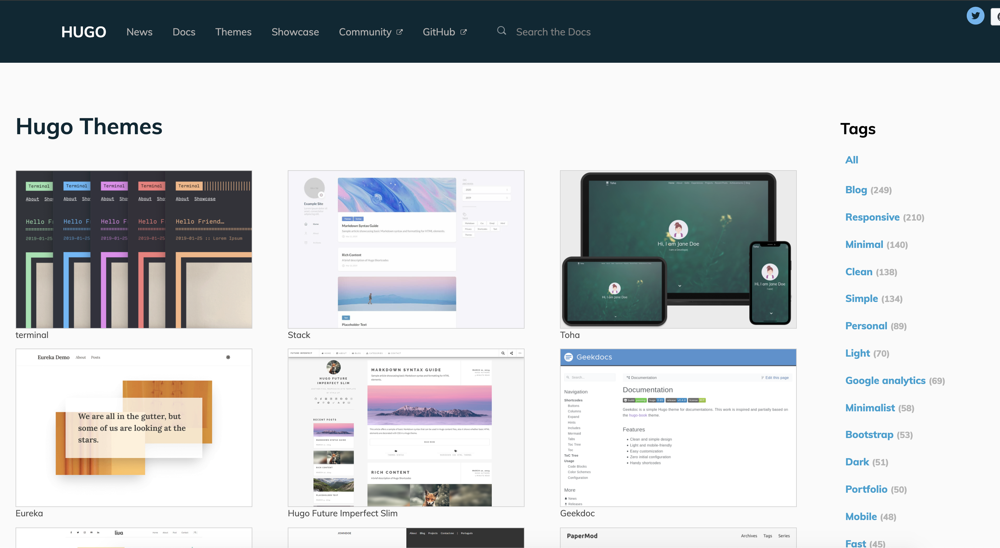

```{css, echo = FALSE}
.remark-slide-content {
  font-size: 20px;
  padding: 20px 80px 20px 80px;
}
.remark-code, .remark-inline-code {
  background: #f0f0f0;
}
.remark-code {
  font-size: 24px;
}
.huge .remark-code { /*Change made here*/
  font-size: 200% !important;
}
.tiny .remark-code { /*Change made here*/
  font-size: 50% !important;
}

#<font size="3" color="red">Text here!</font>
#<div class="col2"> and </div>
#<center>**Here the text is centered. Here are good resources:**</center>

# small image right-aligned
#<div align="right"></div>

#Small image centered:
#<center></center>

```

---

```{r, eval=TRUE, include=FALSE}
library(knitr)
library(magrittr)
library(ggplot2)

opts_chunk$set(
  warning = FALSE,
  #eval=FALSE,
  echo = TRUE,
  fig.width = 7, 
  fig.align = 'center',
  fig.asp = 0.618, # 1 / phi
  out.width = "700px")

#To adjust layout on slide:
#.center[]

#To leave presenter notes
#???

```

# Schedule: 3 Class Sessions on Interactive Visualization 

**10/28 Week 11 (Last week)**:
  - Creating interactive graphs with **plotly** for R package and tables with **DataTable**

**11/04 Week 12 (Today)**: 
  - Create a website using R Markdown and GitHub Pages (like [this](https://abigailhorn.github.io/PM566-final-project/)!)
  - Share interactive plots on the website
  - Survey other options for sharing interactive graphics (Shiny apps, dashboards)

**11/11 Week 13 (Next week)**:  
  1. Guest speakers discussing interactive visualization in practice
    - [BioRealm.ai](https://www.biorealm.ai/) (data science statistical genetics company)
    - [NASA JPL](https://www.jpl.nasa.gov/)

  2. Project workshop


---

# Review: Why use interactive visualization?

Interactive graphics are well suited to aid the exploration of high-dimensional or otherwise complex data. It helps with both the **exploration** and **communication** parts of the data science process:

<div style="text-align: center;">
  <figure>
    
  <figcaption><b>Where interactive visualization fits in to the data science workflow</b></figcaption>
</div>

<br>
<br>
--

- What are some reasonse for using interactive visualization for **exploratory data analysis** (EDA)?

<br>

--

- What are some reasonse for using interactive visualization for **communication**?

---

## Interactive visualization: Topics covered

**Last week**:

  - Interactive plots (`Plotly`)
  
  - Interactive maps (`plotly`, `Leaflet`)
  
  - Interactive tables (`DT`)
  
--

**This week**:

--

  - We will build static websites using R Markdown and GitHub Pages. We will learn how to render text, code, visuals, and interactive visuals created (e.g. with **plotly**, **leaflet**, **DT**, etc.) on the website.
  
--

- We will survey (but not create): 
   
    - Interactive dashboards (`flexdashboard`)
  
    - Interactive (and/or responsive) applications (`shiny`)

---

# Building websites in R Markdown with GitHub Pages

--

To understand how websites are built in R Markdown, we first must understand a bit about how R Markdown documents are rendered, specifically, to produce HTML output.

It is not essential to understand all the inner workings of this process to be able to create a website. However, it is important to understand which component is responsible for what since this will make it easier to target appropriate help files when you need them!

---

## What does R Markdown require to render files?

--

R Markdown combines several different processes together to create documents. In doing so it requires the use of a few essential ingredients (software and packages):

--

- R Markdown: A markup language for creating `.Rmd` files that you have used.

- **rmarkdown**: An R package for processesing and converting `.Rmd` files into a number of different formats.

- **knitr**: An R package for transforming a mixture of R code and text in a `.Rmd` file into a `.md` file by executing the code and 'knitting' the results back into the document. 

- Pandoc: A document converter. It is designed to convert plain text files from one markup language (including `.Rmd` files) into many output formats. It is a command line software with no GUI. Although is separate from R, it comes bundled with R Studio because rmarkdown relies on it for document conversion.

.footnote[*A note on formatting*: **word** indicates an R package, while `word` indicates inline code or file name/format. `word()` indicates a function. Software programs (e.g. R Markdown and Pandoc) are not given a special formatting.]

---

## What happens when we render R Markdown files?

The basic workflow structure for an R Markdown document is shown below, highlighting the steps (arrows) and the intermediate files that are created before producing the output.

<div style="text-align: center;">
  <figure>
    
  <figcaption><b>
</b></figcaption>
</div>

<br>

Rendering R Markdown documents with rmarkdown consists of converting `.Rmd` to `.md` with **knitr**, and then `.md` to our desired output with Pandoc.
---

## What happens when we render R Markdown files? (cont'd)

The workflow in more detail is as follows: 

--

1. The `.Rmd` document is written. It is the original format of the document. It contains a combination of YAML (metadata in the header), text, and code chunks. The YAML header specifies document properties and rendering instructions (like `html_document` for HTML output)

--

2. The `knit()` function in **knitr** is used to execute all code embedded within the `.Rmd` file, and prepare the code output to be displayed within the output document. All these results are converted into the correct markup language and contained within a temporary `.md` file.
  - This `.Rmd`-to-`.md` step handles the execution and "translation" of all code within our report, so changes to content involve editing the `.Rmd` using R code for **knitr** to translate

--

3. The `.md` file is processed by Pandoc. It takes any parameters specified within the YAML frontmatter of the document (e.g., `title`, `author`, and `date`) to convert the document to the output format specified in the `output` parameter (in our case: `html_document` for HTML output)

--

4. The whole process is implemented by R Markdown (the software) via the function from the built-in **rmarkdown** (package): `rmarkdown::render()`

--

Along the way, we add structure and style. A wide range of tools to help us in this process. For creating HTML output, some of these include **cascading style sheets (CSS)** for adding style (e.g., fonts, colors, spacing) to Web documents, raw HTML code, and Pandoc templates. 

---

## YAML metadata

--

A typical YAML header looks like this, and contains basic metadata about the document and rendering instructions:

```yaml
---
title: My R Markdown Website
author: Abigail Horn
output: html_document
---
```

--

The YAML metadata affects the code, content, and the output. It is processed during many stages of the rendering process by **rmarkdown**, **knitr**, and Pandoc:

--

- The `title` and `author` fields are processed by Pandoc to set the values of template variables <sup>1</sup>

- The `output` field is used by **rmarkdown** to apply the output format function `rmarkdown::html_document()` in the rendering process. For creating a website we will need to pass additional arguments to the format that we are specifying in `output`.

--

**We will come back to specify the YAML metadata necessary for setting up a website.**


---

## Beyond Pandoc

Note that not all R Markdown documents are eventually compiled through Pandoc. The intermediate `.md` file could be compiled by other Markdown renderers, including:

- The **xaringan** package passes the `.md` output to a JavaScript library, which renders the Markdown content in the web browser. All slides for this course have been produced using this package!

- The **blogdown** package supports the `.Rmarkdown` document format, which is knitted to `.markdown`, and this Markdown document is usually rendered to HTML by an external site generator. Using **blogdown** is another way to create a website out of R Markdown (but today we will be focusing on creating websites using **rmarkdown** and Pandoc)

---

## What happens when we render R Markdown files? (cont'd)

--

In short, `rmarkdown::render()` = `knitr::knit()` + Pandoc

<br>

--

The YAML metadata in the R Markdown file dictates the process and how the output is produced.

<br>

--

**We will now explore the additional pieces needed to create a website using R Markdown.**

---

# Building a website using **rmarkdown**

---

## Static vs. dynamic websites

A _dynamic site_ relies on a server-side language to do certain computing and sends potentially different content depending on different conditions. A common language is PHP, and a typical example of a dynamic site is a web forum. For example, each user has a profile page, but typically this does not mean the server has stored a different HTML profile page for every single user. Instead, the server will fetch the user data from a database, and render the profile page dynamically.

A _static site_ often consists of HTML files (with optional external dependencies like images and JavaScript libraries), and the web server sends exactly the same content to the web browser no matter who visits the web pages. There is no dynamic computing on the server when a page is requested. 

---

## Creating websites through **rmarkdown**

**rmarkdown** has a built-in static site generator, which we will be using today. It uses Bootstrap styles and themes (which you can choose from).

There are many existing static site generators, including Hugo, Jekyll, and Hexo, etc. These provide many site themes, templates, and features, but are more complex than **rmarkdown**'s built-in generator. 

**rmarkdown**'s site generator is a good option if:
- You are familiar with generating single-page HTML output from R Markdown
- You want to build a simple website with a few pages
- It suffices to use a flat directory of `.Rmd` files
- Don't require features such as forums or RSS feeds

---

## Creating websites through **rmarkdown**

We can render collections of R Markdown documents as a website using the `rmarkdown::render_site()` function

The RStudio IDE (version 1.0 or higher) also includes integrated support for developing R Markdown websites through the `Build` toolbar. These make use of an RStudio Project tied to your website's directory

Today we will focus primarily on using the RStudio IDE


---

# Getting started

---

## Getting started: set up a project directory

<font size="10" color="red">FINISH SLIDE</font>

---

## Essential elements

The minimum requirement for any R Markdown website is that it have an `index.Rmd` file as well as a `_site.yml` file. If you execute the `rmarkdown::render_site()` function from within the directory containing the website, the following will occur:

--

- All of the `*.Rmd` and `*.md` files in the root website directory will be rendered into HTML. Note, however, that Markdown files beginning with `_` are not rendered (this is a convention to designate files that are to be included by top level Rmd documents as child documents).

--

- The generated HTML files and any supporting files (e.g., CSS and JavaScript) are copied into an output directory (`_site` by default).

--

The HTML files within the `_site` directory are now ready to deploy as a standalone static website.

---

## A simple example

To start with, let's walk through a very simple example, a website that includes two pages (`Home` and `About`) and a navigation bar to switch between them.

--

First, we need a configuration file `_site.yml`:

```yaml
name: "my-website"
navbar:
  title: "My Website"
  left:
    - text: "Home"
      href: index.html
    - text: "About"
      href: about.html
```

---

## A simple example (cont'd)

Then two Rmd files, `index.Rmd`:

```markdown
---
title: "My Website"
---

Hello, Website!
```

and `about.Rmd`:

```markdown
---
title: "About This Website"
---

More about this website.
```

---

# Common elements

---

## Common elements: content

Typically when creating a website, there are various common elements you want to include on all pages (e.g., output options, CSS styles, header and footer elements, etc.)

A `_site.yml` should look like this:

.tiny[
```yaml
name: "my-website"
navbar:
  title: "My Website"
  left:
    - text: "Home"
      href: index.html
    - text: "About"
      href: about.html
output:
  html_document:
    theme: cosmo
    highlight: textmate
    include:
      after_body: footer.html
    css: styles.css
```
]

---

## Common elements: content

- `footer.html`:

    ```html
    <p>Copyright &copy; 2016 Skynet, Inc. All rights reserved.</p>
    ```

- `styles.css`

    ```css
    blockquote {
      font-style: italic
    }
    ```

---

## Common elements: content

- Note that we have included an `output` element within our `_site.yml` file. This defines shared output options for all R Markdown documents within a site. Note that individual documents can also include their own `output` options, which will be merged with the common options at render time.

- As part of our common output options, we have specified an HTML footer (via the `include: after-body:` option) and a CSS stylesheet. You can also include HTML before the body or in the document's `<head>` 

--

- In addition to whatever common options you define, there are two output options that are automatically set when rendering a site:

  - The `self_contained` option is set `FALSE`
  - The `lib_dir` option is set to `site_libs`.

These options are set so that dependent files (e.g., jQuery, Bootstrap, and HTML widget libraries) are shared across all documents within the site rather than redundantly embedded within each document.

---

## R scripts

If you have R code that you would like to share across multiple R Markdown documents within your site, you can create an R script (e.g., `utils.R`) and source it within your Rmd files. For example:

````markdown
`r ''````{r}
source("utils.R")
```
````

---


## Site navigation

The `navbar` element of `_site.yml` can be used to define a common navigation bar for your website. You can include internal and external links on the navigation bar as well as drop-down menus for sites with a large number of pages.

Here is a navigation bar definition in `_site.yml` that makes use of a variety of features:

.tiny[
```yaml
name: "my-website"
navbar:
  title: "My Website"
  type: inverse
  left:
    - text: "Home"
      icon: fa-home
      href: index.html
    - text: "About"
      icon: fa-info
      href: about.html
    - text: "More"
      icon: fa-gear
      menu:
        - text: "Heading 1"
        - text: "Page A"
          href: page-a.html
        - text: "Page B"
          href: page-b.html
        - text: "---------"
        - text: "Heading 2"
        - text: "Page C"
          href: page-c.html
        - text: "Page D"
          href: page-d.html
  right:
    - icon: fa-question fa-lg
      href: https://example.com
```
]

---

## Site navigation

This example demonstrates a number of capabilities of navigation bars:

- You can use the `type` field to choose between the `default` and `inverse` navigation bar styles (each theme includes distinct colors for "default" and "inverse" navigation bars).

--

- You can align navigational items either to the `left` or to the `right`.

--

- You can include menus on the navigation bar, and those menus can have separators (`text: "--------------"`) and internal headings (`text` without a corresponding `href`).

--

- You can include both internal and external links on the navigation bar.

--

- You can use icons on the navigation bar. Icons from three different icon sets are available.

    - [Font Awesome](https://fontawesome.com/icons)
    - [Ionicons](http://ionicons.com/)
    - [Bootstrap Glyphicons](https://getbootstrap.com/docs/3.3/components/#glyphicons)

When referring to an icon, you should use its full name including the icon set prefix (e.g., `fa-github`, `ion-social-twitter`, and `glyphicon-time`).

---

## HTML navigation bar

If you want to have even more control over the appearance and behavior of the navigation bar, you can define it in HTML rather than YAML. If you include a file named `_navbar.html` in your website directory, it will be used as the navigation bar. Here is an example of navigation bar defined in HTML: <https://github.com/rstudio/rmarkdown-website/blob/master/_navbar.html>.

Full documentation on syntax of Bootstrap navigation bars can be found here: <http://getbootstrap.com/components/>.

---

## Site and output configuration

The `_site.yml` file has a number of options that affect site output, including where it is written and what files are included and excluded from the site. Here is an example that makes use of a few of these options:

```yaml
name: "my-website"
output_dir: "_site"
include: ["import.R"]
exclude: ["docs.txt", "*.csv"]
```

--

- The `name` field provides a suggested URL path for your website when it is published (by default this is just the name of the directory containing the site).

--

- The `output_dir` field indicates which directory to copy site content into (`"_site"` is the default if none is specified). It can be `"."` to keep all content within the root website directory alongside the source code.

---

## Included files

The `include` and `exclude` fields enable you to override the default behavior vis-a-vis what files are copied into the output directory. By default, all files within the website directory are copied into the output directory EXCEPT for the following:

1. Files beginning with `.` (hidden files).

2. Files beginning with `_`.

3. Files known to contain R source code (e.g., `*.R`, `*.s`, `*.Rmd`), R data (e.g., `*.RData`, `*..rds`), or configuration data (e.g., `*.Rproj`, `rsconnect`).

The `include` and `exclude` fields of `_site.yml` can be used to override this default behavior

Note that `include` and `exclude` are *not* used to determine which Rmd files are rendered: all files in the root directory *save for those named with the `_` prefix* will be rendered.

---

## Rendering and building the site

As you work on the individual pages of your website, you can render them using the `Knit` button just as you do with conventional standalone R Markdown documents

```{r echo=FALSE, out.width='30%'}
knitr::include_graphics('img/site-page.png', dpi = NA)
```

Knitting an individual page will only render and preview that page, not the other pages in the website.

To render all of the pages in the website, you use the `Build` pane, which calls `rmarkdown::render_site()` to build and then preview the entire site

```{r site-build, echo=FALSE, fig.cap='Build an entire website in RStudio.', out.width='30%'}
knitr::include_graphics('img/site-build.png', dpi = NA)
```

---

## Rendering and building the site (cont'd)

RStudio supports "live preview" of changes that you make to supporting files within your website (e.g., CSS, JavaScript, Rmd partials, R scripts, and YAML config files).

Changes to CSS and JavaScript files always result in a refresh of the currently active page preview. Changes to other files (e.g., shared scripts and configuration files) trigger a rebuild of the active page (this behavior can be disabled via the options dialog available from the `Build` pane).

Note that only the active page is rebuilt, so once you are happy with the results of rendering you should make sure to rebuild the entire site from the `Build` pane to ensure that all pages inherit your changes.

---

## Rendering and building the site: command line

Or from command line: you can call the `render_site()` function directly from within the website directory. Pass no arguments to render the entire site or a single file in order to render just that file:

```r
# render the entire site
rmarkdown::render_site()
# render a single file only
rmarkdown::render_site("about.Rmd")
```

---

# Helpful features

---

## Adding interactive content

R Markdown includes many facilities for generation of HTML content from R objects, including:

- The conversion of standard R output types (e.g., **ggplot2** objects) within code chunks done automatically by **knitr**

- A variety of ways to generate HTML tables, including the `knitr::kable()` function and other packages such as **kableExtra**

- A large number of available HTML widgets (e.g., **plotly** objects) that provide rich JavaScript data visualizations.

As a result, for many R Markdown websites _you will not need to worry about generating HTML output at all_ (since it is created automatically).


---

## Saving interactive plots as HTML widgets

If you are having issues with embedding interactive plots, you can use the package **widgetframe** to save HTML files via an HTML `iframe`. This is convenient not only for re-using a widget in various parent documents, but also for preventing any JavaScript and CSS in the parent document from negatively impacting how the widget renders

The **widgetframe** package automates the saving of widgetframe packages into <iframes> and has options for controling where, how, and if external dependencies are stored on the file system when using it inside a knitr/rmarkdown document. **widgetframe** is designed to be used in `.Rmd` documents which will eventually be knitted to an HTML or a derived format. Use the default options and embed files like this:

````markdown
`r ''````{r}
library(widgetframe)
test.widget <- plot_ly()
widgetframe::frameWidget(test.widget, width = '75%')
```
````

**widgetframe** will take care of embedding the supporting HTML widget libraries in a folder together.

---

## knitr caching

If your website is time consuming to render, you may want to enable **knitr**'s caching during the development of the site, so that you can more rapidly preview. To enable caching for an individual chunk, just add the `cache = TRUE` chunk option:

````markdown
`r ''````{r, cache = TRUE}
data <- longComputation()
```
````

To enable caching for an entire document, add `cache = TRUE` to the global chunk option defaults:

````markdown
`r ''````{r setup, include=FALSE}
knitr::opts_chunk$set(cache = TRUE)
```
````

Note that when caching is enabled for an Rmd document, its `*_files` directory will be copied rather than moved to the `_site` directory (since the cache requires references to generated figures in the `*_files` directory).


---

## Cleaning up files

To clean up all of the files generated via `render_site()`, you can call the `clean_site()` function, which will remove all files generated by rendering your site's Markdown documents, including **knitr**'s `*_cache` directories. You can specify the `preview = FALSE` option to just list the files to be removed rather than actually removing them:

```r
# list which files will be removed
rmarkdown::clean_site(preview = TRUE)
# actually remove the files
rmarkdown::clean_site()
```

---

## Themes

We can change the website’s theme in _site.yml. Explore options here: http://rmarkdown.rstudio.com/html_document_format.html#appearance_and_style:

Valid themes include “default”, “cerulean”, “journal”, “flatly”, “readable”, “spacelab”, “united”, “cosmo”, “lumen”, “paper”, “sandstone”, “simplex”, and “yeti”.


---

## Helpful HTML

Font size and color
`<font size="3" color="red">Text here!</font>`

Columns
`<div class="col2"> and </div>`

Centered text
`<center>**Here the text is centered. Here are good resources:**</center>`

Small image right-aligned
`<div align="right"></div>`

Large image centered:
`<center></center>`

---

# Deploying website

<font size="10" color="red">FINISH SLIDE</font>

R Markdown websites are static HTML sites that can be deployed to any standard web server. All site content (generated documents and supporting files) are copied into the `_site` directory, so deployment is simply a matter of moving that directory to the appropriate directory of a web server.

We will focus on hosting websites through GitHub pages. Hosting websites on GitHub pages is free.

There are other free sites for website hosting, and another popular choice is [Netlify](https://www.netlify.com/).


---

# More advanced website creation options with .Rmd files

**blogdown** package, built on the third-party static website generator Hugo: provides support for developing a website from `.Rmd` files based on Hugo
  
Benefits of **blogdown**/Hugo combination over **rmarkdown** built in generator: 

- Hugo is a general-purpose site generator that is highly customizable, many themes available
- Supports more features, e.g. RSS feeds, metadata especially common in blogs such as categories and tags
- faster to render content
- extended syntax, which means it is highly suitable for technical writing

<div style="text-align: center;">
  <a href="https://themes.gohugo.io/">
  <figure>
    
  <figcaption><b>Window into the themes available from Hugo's website generator</b></figcaption>
</div>


---

# More Resources

#### Further resources on website development in **rmarkdown**

Tutorials on creating a website using **rmarkdown**:
- [Creating websites in R](https://www.emilyzabor.com/tutorials/rmarkdown_websites_tutorial.html), Emily C. Zabor 
- [Nick Strayer & Lucy D'Agostino McGowan](https://livefreeordichotomize.com/2017/08/08/how-to-make-an-rmarkdown-website/)

#### More advanced website development using `.Rmd`

- For more advanced website creation using **blogdown** and the website generator Hugo see [Creating websites with R Markdown](https://bookdown.org/yihui/blogdown/)
- [Appendix B](https://bookdown.org/yihui/blogdown/website-basics.html#website-basics) of the **blogdown** book presents basic information about websites, such as HTML, CSS, and JavaScript
- A good resource for further information on customizing CSS and JavaScript is [w3schools](https://www.w3schools.com/w3css/defaulT.asp)

#### R Markdown

- The comprehensive reference on R Markdown is [here](https://bookdown.org/yihui/rmarkdown/)
- The R Markdown cheatsheet is [here](https://rstudio.com/wp-content/uploads/2015/02/rmarkdown-cheatsheet.pdf)

#### Making and posting interactive plots `shiny` and dashboards

- [The `Shiny` Website](http://shiny.rstudio.com)
- [R Markdown: The Definitive Guide, Chapter 5: Dashboards (Layout, Components, Shiny)](https://bookdown.org/yihui/rmarkdown/dashboards.html)

---

# References

This lecture is based on [Chapter 10.5: Websites in rmarkdown’s site generator](https://bookdown.org/yihui/rmarkdown/rmarkdown-site.html) from the book [R Markdown: The Definitive Guide](https://bookdown.org/yihui/rmarkdown/), by Yihui Xie, J. J. Allaire, Garrett Grolemund 

It pulls also from the tutorial [Creating websites in R](https://www.emilyzabor.com/tutorials/rmarkdown_websites_tutorial.html) by Emily C. Zabor 
