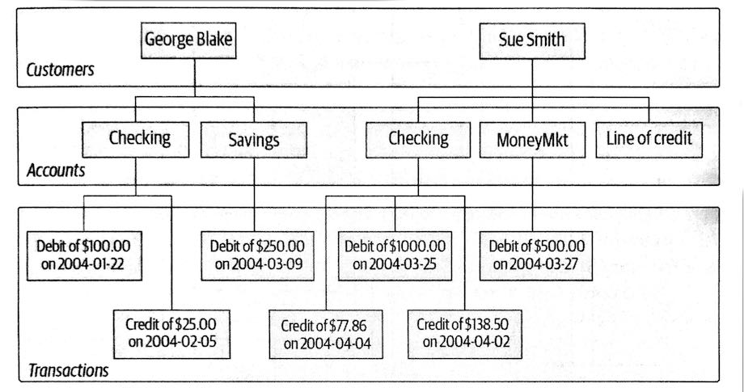
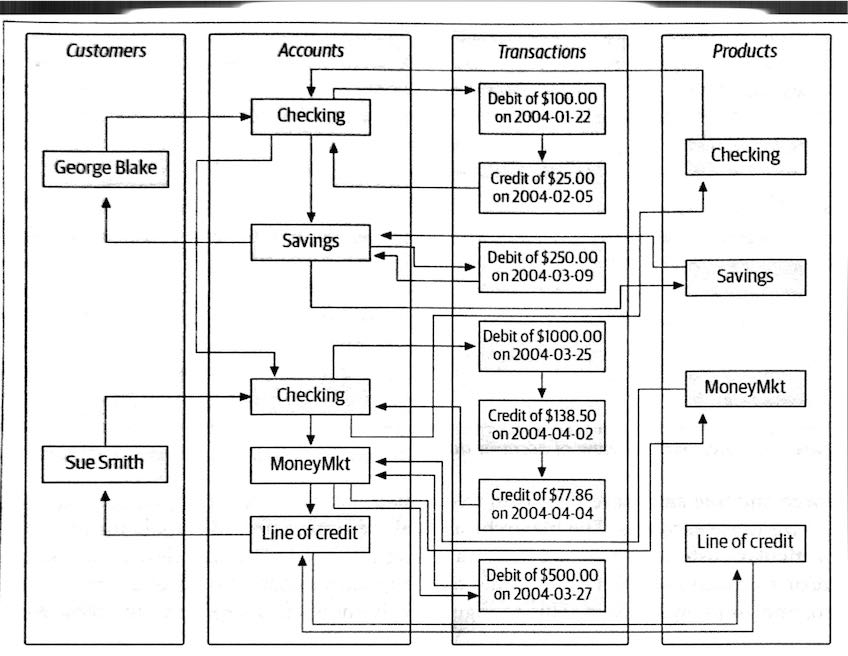

```{r include=FALSE}
library(knitr)
hook_output <- knit_hooks$get("output")
knit_hooks$set(output = function(x, options) {
  lines <- options$output.lines
  if (is.null(lines)) {
    return(hook_output(x, options))  # pass to default hook
  }
  x <- unlist(strsplit(x, "\n"))
  more <- "..."
  if (length(lines) == 1) {        # first n lines
    if (length(x) > lines) {
      # truncate the output, but add ....
      x <- c(head(x, lines), more)
    }
  } else {
    x <- c(more, x[lines], more)
  }
  # paste these lines together
  x <- paste(c(x, ""), collapse = "\n")
  hook_output(x, options)
})
knit_hooks$set(output = function(x, options) {
  # this hook is used only when the linewidth option is not NULL
  if (!is.null(n <- options$linewidth)) {
    x = knitr:::split_lines(x)
    # any lines wider than n should be wrapped
    if (any(nchar(x) > n)) x = strwrap(x, width = n)
    x = paste(x, collapse = '\n')
  }
  hook_output(x, options)
})

opts_chunk$set(
  echo = TRUE,
  fig.width = 7, 
  fig.align = 'center',
  fig.asp = 0.618, # 1 / phi
  out.width = "700px")
```

```{r, echo = FALSE}
library(sass)
sass(sass_file("theme.sass"), output = "theme.css")
```

```{css, echo = FALSE}
.orange {color: #EF8633}
```

```{r, echo=FALSE}
library(RSQLite)
library(DBI)

# Initialize a temporary in memory database
con <- dbConnect(SQLite(), ":memory:")

dbWriteTable(con, "penguins", palmerpenguins::penguins)
```


# Plan for the week

- See what relational databases are
- How to query a relational database with SQL
- How SQL have similaties with dplyr

---

# NOTE 

sql is a full language with 100s of commmands.
We will not be able to cover everything.
We are going to look at a small sample to showcase the powers, capabilities and similarities to data.table/dplyr

---

# Optional reading material

.center[

]

---

# Database


## Simple definition

> A set of related information

<br><br>

Examples include:

- phone book
- Dictionary
- Cookbook

---

# Order / indexing matters

The ordering of the entries will make some tasks easier and some harder.

A phone book makes it easy to find a person if you know the name, but not if you only know the address

Dictionaries are not helpful to find the longest words

Once the book is printed then it starts going out of date

---

# Hierarchical database system

.center[

]

---

# Network database system

.center[

]

---

# Relational database system

.center[

]

---

All of these systems contain 4 entities

- `customer`
- `product`
- `account`
- `transaction`

Each table in a relational database contains information that uniquely identifies that row in the table (Primary key)

---

# Relation between tables

some columns contain shared information across tables.

These columns are called *foreign keys* and they serve the purpose of connection the rows in different tables together

---

### Terminology

- **Entity** Something of interest to the users
- **Column** An individual peice of data stored in a table
- **Row** A set of columns thatt together completely describe an entity or some action on an entity. Also called a **record**
- **Table** A set of rows
- **Result key** Another name for a nonpersistent table, generally the result of a SQL query
- **Primary key** One or more columns that can be used as a unique identifier for each row in a table
- **Foreign key** One or more columns that can be used together to identify a single row in another table

---

# What is SQL?

A language created to manipulate data in relational databases.

Over 40 years old.

The American National Standards Institute (ANSI) have developed standards for SQL

---

# A Nonprocedural Language

In R we are used to being able to define variables, use conditional logic (if, if-else, while), looping/iteration and writing functions

In general are we in complete control of what the code is doing.

--

<br>

We give up some of that when using SQL.

When using SQL then we specify the input and output we desire, the this is sent to your database engine known as the **optimizer**

The optimizer figures out the best way to get from input to output

---

# Different databases

There are different SQL databases that operate slightly different. MySQL, PostgreSQL, MariaDB, SQLite

We will try to give a general overview

Google is your friend

All examples shown with SQLite

---

# SQL query clauses

- **SELECT** Determines which columns to include the query's result set
- **FROM** Identifies the tables from which to retrive daat and how the tables should be joined
- **WHERE** Filters out unwanted data
- **GROUP BY** Used to group rows together by common column values
- **HAVING** Filters out unwanted groups
- **ORDER BY** Sorts the rows of the final result set by one or more columns

---

# Pengiuns data

```{r, echo=FALSE}
reactable::reactable(palmerpenguins::penguins)
```

---

# Select clause

```{sql, connection=con, output.var="x1"}
SELECT species, island, bill_length_mm
FROM penguins
```

```{r, echo=FALSE}
x1
```

---

# Select clause

```{sql, connection=con, output.var="x2"}
SELECT *
FROM penguins
```

```{r, echo=FALSE}
x2
```

---

# Select clause - aliases

```{sql, connection=con, output.var="x3"}
SELECT upper(island) AS island,
  bill_length_mm * bill_depth_mm AS bill_area_mm
FROM penguins
```

```{r, echo=FALSE}
x3
```

---

# Select clause - removing duplicates

```{sql, connection=con, output.var="x4"}
SELECT DISTINCT island, species
FROM penguins
```

```{r, echo=FALSE}
x4
```

---

# From clause - subquery

```{sql, connection=con, output.var="x5"}
SELECT a.bill_length_mm, a.bill_depth_mm
FROM
  (SELECT species, bill_length_mm, bill_depth_mm
   FROM penguins
   WHERE species = 'Adelie'
  ) AS a
```

```{r, echo=FALSE}
x5
```

---

# Where clause

```{sql, connection=con, output.var="x6"}
SELECT species, island, bill_length_mm, bill_length_mm, year
FROM penguins
WHERE year = 2007
```

```{r, echo=FALSE}
x6
```

---

# Where clause

```{sql, connection=con, output.var="x7"}
SELECT species, island, bill_length_mm, bill_length_mm, year
FROM penguins
WHERE year > 2007
```

```{r, echo=FALSE}
x7
```

---

# Where clause

```{sql, connection=con, output.var="x8"}
SELECT species, island, bill_length_mm, bill_length_mm, year
FROM penguins
WHERE year IN (2007, 2008)
```

```{r, echo=FALSE}
x8
```

---

# Where clause

```{sql, connection=con, output.var="x9"}
SELECT species, island, bill_length_mm, bill_length_mm, year
FROM penguins
WHERE year = 2007 AND species = 'Gentoo'
```

```{r, echo=FALSE}
x9
```

---

# Where clause

```{sql, connection=con, output.var="x10"}
SELECT species, island, bill_length_mm, bill_length_mm, year
FROM penguins
WHERE year = 2007 OR species = 'Gentoo'
```

```{r, echo=FALSE}
x10
```

---

# Order by clause

```{sql, connection=con, output.var="x11"}
SELECT species, island, bill_length_mm, bill_depth_mm
FROM penguins
ORDER BY bill_length_mm
```

```{r, echo=FALSE}
x11
```

---

# Order by clause

```{sql, connection=con, output.var="x12"}
SELECT species, island, bill_length_mm, bill_depth_mm
FROM penguins
ORDER BY bill_length_mm DESC
```

```{r, echo=FALSE}
x12
```

---

# Order by clause

```{sql, connection=con, output.var="x13"}
SELECT species, island, bill_length_mm, bill_depth_mm
FROM penguins
ORDER BY bill_length_mm ASC
```

```{r, echo=FALSE}
x13
```

---

# Order by clause

```{sql, connection=con, output.var="x14"}
SELECT species, island, bill_length_mm, bill_depth_mm
FROM penguins
ORDER BY bill_length_mm, bill_depth_mm
```

```{r, echo=FALSE}
x14
```

---

# group by clause

```{sql, connection=con, output.var="x15"}
SELECT 
  AVG(bill_length_mm) AS avg_bill_length, 
  AVG(bill_depth_mm) AS avg_bill_depth
FROM penguins
```

```{r, echo=FALSE}
x15
```

---

# group by clause

```{sql, connection=con, output.var="x16"}
SELECT island,
  AVG(bill_length_mm) AS avg_bill_length, 
  AVG(bill_depth_mm) AS avg_bill_depth
FROM penguins
GROUP BY island
```

```{r, echo=FALSE}
x16
```

---

# group by clause

```{sql, connection=con, output.var="x17"}
SELECT island, species,
  AVG(bill_length_mm) AS avg_bill_length, 
  AVG(bill_depth_mm) AS avg_bill_depth
FROM penguins
GROUP BY island, species
```

```{r, echo=FALSE}
x17
```

---

# group by clause - count

```{sql, connection=con, output.var="x18"}
SELECT island, species,
  COUNT(*) AS count
FROM penguins
GROUP BY island, species
```

```{r, echo=FALSE}
x18
```

---

# group by clause - count

```{sql, connection=con, output.var="x19"}
SELECT island, species,
  COUNT(*) AS count
FROM penguins
GROUP BY island, species
HAVING COUNT(*) < 100
```

```{r, echo=FALSE}
x19
```


```{r, echo=FALSE}
# clean up
dbDisconnect(con)
```
