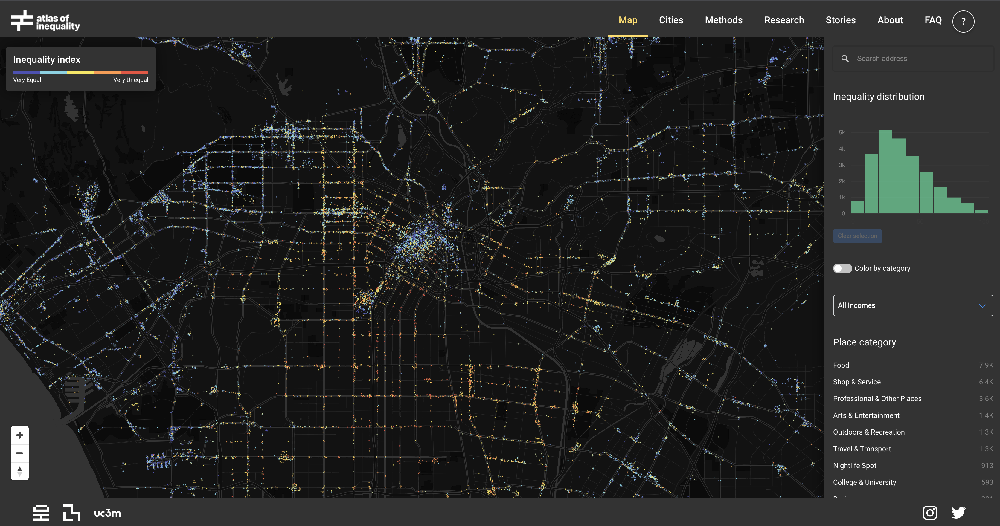

<style type="text/css">
pre{
  font-size:20px;
}
code.r,code.cpp{
  font-size:medium
}
</style>


```{r, eval=TRUE, include=FALSE}
library(knitr)
library(tidyr)
library(magrittr)
library(ggplot2)
# # load required packages
if(!require(magrittr)) install.packages("magrittr", repos = "http://cran.us.r-project.org")
#if(!require(rvest)) install.packages("rvest", repos = "http://cran.us.r-project.org")
#if(!require(readxl)) install.packages("readxl", repos = "http://cran.us.r-project.org")
if(!require(dplyr)) install.packages("dplyr", repos = "http://cran.us.r-project.org")
#if(!require(maps)) install.packages("maps", repos = "http://cran.us.r-project.org")
if(!require(ggplot2)) install.packages("ggplot2", repos = "http://cran.us.r-project.org")
#if(!require(reshape2)) install.packages("reshape2", repos = "http://cran.us.r-project.org")
#if(!require(ggiraph)) install.packages("ggiraph", repos = "http://cran.us.r-project.org")
#if(!require(RColorBrewer)) install.packages("RColorBrewer", repos = "http://cran.us.r-project.org")
#if(!require(leaflet)) install.packages("leaflet", repos = "http://cran.us.r-project.org")
if(!require(plotly)) install.packages("plotly", repos = "http://cran.us.r-project.org")
#if(!require(geojsonio)) install.packages("geojsonio", repos = "http://cran.us.r-project.org")
if(!require(here)) install.packages("here", repos = "http://cran.us.r-project.org")
if(!require(fs)) install.packages("fs", repos = "http://cran.us.r-project.org")
if(!require(widgetframe)) install.packages("widgetframe", repos = "http://cran.us.r-project.org")

opts_chunk$set(
  warning = FALSE,
  #eval=FALSE,
  echo = TRUE,
  fig.width = 7, 
  fig.align = 'center',
  fig.asp = 0.618, # 1 / phi
  out.width = "700px")

options(htmltools.dir.version = TRUE)


```

# Introduction to interactive visualization

---

## What is interactive visualization?

- Interactive visualization involves the creation and sharing of graphical representations of data, model, or results that allow a user to directly manipulate and explore

- Some example products and packages in R:
--

  - Interactive plots (`Plotly`)
  
  - Interactive maps (`plotly`, `Leaflet`)
  
  - Interactive tables (`DT`)
  
  - Dashboards (`flexdashboard`)
  
  - Interactive applications (`shiny`)
  
  - Websites (Static using `R Markdown`, `blogdown`, `Hugo`, `Jeckyll`)

---

## What is interactive visualization (cont'd)

- Interactivity allows users to engage with data / models in a way that static visuals cannot

- Features of interactivity include: 
--
  
  - Identify, isolate, and visualize information for extended periods of time 

  - Zoom in and out

  - Highlight relevant information
    
  - Get more information
  
  - Filter
    
  - Animate
  
  - Change parameters

---

# Why use interactive visualization?

Interactive visualization helps with both the **exploration** and **communication** parts of the data science process

<div style="text-align: center;">
  <figure>
    
  <figcaption><b>Where interactive visualization fits in to the data science workflow</b></figcaption>
</div>

---

## Interactive Visualization for **exploratory data analysis** (EDA)

Interactive graphics are well suited to aid the exploration of high-dimensional or otherwise complex data. Interacting with information in a visual way helps to enable insights that wouldn’t be easy or even possible with static graphics, for reasons including:

--

1. **Investigate faster**: In a true exploratory setting, you have to make lots of visualizations, and investigate lots of follow-up questions, before stumbling across something truly valuable. Interactive visualization can aid in the sense-making process by searching for information quickly without fully specified questions (Unwin and Hofmann 1999)

--

2. **Identifying relationships or structure that would otherwise go missing** (J. W. Tukey and Fisherkeller 1973)

--

3. **Understand or diagnose problems with data, models, or algorithms** (Wickham, Cook, and Hofmann 2015)

---

## Interactive visualization for **communication**

Interactive graphics are well suited to communicating high-dimensional or otherwise complex data. Interacting with information in a visual way may help communicating data, models, and results for reasons including: 

(1) Engagement with information has been shown to improve the ability to retain information

<div style="text-align: center;">
  <figure>
    
  <figcaption><b>Edgar Dale's Cone of Learning</b></figcaption>
</div>

---

## Interactive visualization for **communication** (cont'd)

(2) Automate and efficiently share multiple dimensions of data/models/findings or complex analysis tasks

(3) Help users to better understand, and make decisions on, data/models/findings

<div style="text-align: center;">
  <a href="https://epimodel.shinyapps.io/covid-university/">
  <figure>
    
  <figcaption><b>EpiModel Shiny app for COVID testing at universities</b></figcaption>
</div>

---

## Interactive visualization for **communication** (cont'd)

(4) Tell a more interesting or engaging story, presenting multiple viewpoints of data

(5) Allow users to focus on the aspects most important to them, making the user more likely to understand, learn from, remember and appreciate the data

<div style="text-align: center;">
  <a href="https://inequality.media.mit.edu/">
  <figure>
    
  <figcaption><b>MIT Media Lab Atlas of Inequality</b></figcaption>
</div>

---

# 2 Classes on Interactive Visualization in Data Science

**Today**:
  - Creating interactive graphs with **plotly** for R package and tables with **DataTable**

**Next week**: 
  - Create a website using RStudio and GitHub Pages
  - Share your interactive graphics
  - Survey other options for sharing interactive graphics (Shiny apps, dashboards)

---

# Plotly

---

## What is Plotly?

<div style="text-align: center;">
  <figure>
    
</div>

  - Plotly is an open source library for creating and sharing interactive graphics

  - It is powered by the JavaScript graphing library [plotly.js](https://github.com/plotly/plotly.js) and is designed on principles of adding layers

  - Plotly can work with several programming languages and applications including R, JavaScript,
Python, Matlab, and Excel. 

  - Plotly for R graphics are based on the `htmlwidgets` framework, which allows them to work seamlessly inside of larger rmarkdown documents, inside shiny apps, RStudio, Jupyter notebooks, the R prompt, and more.

---

## `plot_ly()` vs. `ggplotly()`

- There are two main ways to create a plotly object:

--

  - Transforming a `ggplot2` object (via `ggplotly()`) into a plotly object 

--

  - Directly initializing a plotly object with `plot_ly()`/`plot_geo()`/`plot_mapbox()`. This provides a 'direct' interface to plotly.js with some additional abstractions to help reduce typing

--

- Both approaches are powered by plotly.js so many of the same concepts and tools that you learn for one interface can be reused in the other

---

## `plot_ly()` function

- The `plot_ly()` function has numerous arguments that are unique to the R package (e.g., `color`, `stroke`, `span`, `symbol`, `linetype`, etc.) and make it easier to encode data variables as visual properties (e.g., color). By default, these arguments map values of a data variable to a visual range defined by the plural form of the argument

--

- (almost) every function anticipates a **plotly** object as input to its first argument and returns a modified version of that **plotly** object 

--

- The `layout()` function, which modifies layout components of the plotly object, anticipates a **plotly** object in its first argument and its other arguments add and/or modify various layout components of that object (e.g., the title)

--

- A family of `add_*()` functions (e.g., `add_histogram()`, `add_lines()`, `add_trace()`, etc.) define how to render data into geometric objects by adding a graphical layer to a plot. Layers can be included to add: 

--
  - data
  - aesthetic mappings (e.g., assigning `clarity` to `color`)
  - geometric representation (e.g., rectangles, circles, etc.)
  - statistical transformations (e.g., sum, mean, etc.)
  - positional adjustments (e.g., dodge, stack, etc.) 

---

## `ggplotly()`

- We also have the option of working with the `ggplotly()` function from the **plotly** package, which can translate **ggplot2** to **plotly**. 

- The essence of this is very straightforward: 

```{r, eval=FALSE}
p <- ggplot(*) + geom_*()
ggplotly(p)
```

--

- This functionality can be really helpful for quickly adding interactivity to your existing **ggplot2** workflow.

--

- `ggplotly()` provides advantages to `plot_ly()` in particular when it comes to exploring statistical summaries across groups. The ability to quickly generate statistical summaries across groups and map to an interactive plot works for basically any geom (e.g., `geom_boxplot()`, `geom_histogram()`, `geom_density()`, etc.)

---

# Getting started

---

## Install Plotly

```{r, eval=TRUE, warning=FALSE, message=FALSE}
if(!require(plotly)) install.packages("plotly", repos = "http://cran.us.r-project.org")
library(plotly)
```

---

## Load data for examples 

For examples today we will be using COVID data direct downloaded from the New York Times GitHub repository: https://raw.githubusercontent.com/nytimes/covid-19-data/master/us-states.csv

This data source provides COVID cases (confirmed infections) and deaths by each US state and each date

We have preprocessed this data and added some additional variables in the file `"input_data/coronavirus_states.csv"`
  - `population` of each state
  - `new_cases`: daily change in cases
  - `new_deaths`: daily change in deaths
  - `per100k`: cases per 100,000 population
  - `deathsper100k`: deaths per 100,000 population
  - `naive_CFR`: naive[1] Case Fatality Rate (CFR) = deaths / cases, for each state on each date
  
In the lab we will preprocess this data together.

.footnote[[1]"naive" since calculation of CFR requires more sophisticated modeling to account for time delays between cases and deaths]

---

## Load data for examples

```{r, eval=TRUE, echo=TRUE, message=FALSE}
# import data

cv_states = read.csv(path(here("website/static/slides/11-interactive-viz/input_data/coronavirus_states.csv")))

# format the date
cv_states$date = as.Date(cv_states$date, format="%Y-%m-%d")

# create most recent day data frame
cv_states_today = subset(cv_states, date==max(cv_states$date))
```

---

## Load data for examples

Inspect the data

```{r, eval=TRUE}
str(cv_states)
```

---

## Load data for examples

Inspect the data

```{r, eval=TRUE}
#dim(cv_states)
summary(cv_states)
```

---

# Examples

---

## Basic Scatterplot

Let's start with a scatterplot of population-normalized (`per100k`) deaths vs. cases on the most recent date from dataframe `cv_states_today`

- Specify a scatterplot by `type = "scatter"` and `mode = 'markers'`
- Notice how the arguments for the `x` and `y` variables as specified as formulas, with the tilde operator (`~`)
- Use `color` to specify an additional data dimension (factor or continuous), and map each level of the dimension to a different color (factor or continuous) 
- `colors` is used to specify the range of colors

```{r, eval=FALSE}
cv_states_today %>% 
           plot_ly(x = ~deathsper100k, y = ~per100k, 
                   type = 'scatter',
                   mode = 'markers',
                   color = ~state,
                   colors = "Blues")
```

---

## Basic Scatterplot

```{r, echo=FALSE, message=FALSE}
library(plotly)
library(widgetframe)
test.widget <- 
  cv_states_today %>% 
           plot_ly(x = ~deathsper100k, y = ~per100k, 
                   type = 'scatter',
                   mode = 'markers',
                   color = ~state,
                   colors = "Blues")
#widgetframe::frameWidget(test.widget, width = '75%')
widgetframe::frameWidget(test.widget, width = '75%')

```

<br>
<br>

- Scatterplot of deaths vs. cases population-normalized (`per100k`)
- plotly allows us to hover and see the exact $(x,y)$ values of each point
- Notice the automatic `tooltip` that appears when your mouse hovers over each point
- Doubleclick any item in legend to isolate that point in the plot

---

## Scatterplot: size

- You can add an additional dimension by adjusting the `size` of each point (also with `~` operator)
  - Specify the limits of the size through `sizes`
  - `sizemode` specifies `'area'` or `'diameter'`
- Here we specify size as mapped to each state's `naive_CFR`

```{r, eval=FALSE}
cv_states_today %>% 
           plot_ly(x = ~deathsper100k, y = ~per100k, 
                   type = 'scatter',
                   mode = 'markers',
                   color = ~state,
                   size = ~naive_CFR,
                   sizes = c(5, 70),
                   marker = list(sizemode='diameter', opacity=0.5))

```

---

## Scatterplot: size

```{r, echo=FALSE, message=FALSE}
test.widget.2 <- cv_states_today %>% 
           plot_ly(x = ~deathsper100k, y = ~per100k, 
                   type = 'scatter',
                   mode = 'markers',
                   color = ~state,
                   size = ~naive_CFR,
                   sizes = c(5, 70),
                   marker = list(sizemode='diameter', opacity=0.5))

widgetframe::frameWidget(test.widget.2, width = '85%')

```

<br>
<br>

The closer to the bottom right corner of the plot, the higher the CFR, and the larger the point's circle.
---

## Specifying hover information

- You can specify what info will appear when hovering using `hoverinfo` through the `text` argument (also with `~` operator)
  - Multiple variables can be included upon hover
  - Create new lines between variables in `hoverinfo` using `sep = "<br>"`
- Let's add `per100k`, `deathsper100k`, and `naive_CFR` to the hover info:

```{r, eval=FALSE}
cv_states_today %>% 
  plot_ly(x = ~deathsper100k, y = ~per100k, 
          type = 'scatter', mode = 'markers', color = ~state,
          size = ~naive_CFR, sizes = c(5, 70), marker = list(sizemode='diameter', opacity=0.5),
          hoverinfo = 'text',
          text = ~paste( paste(state, ":", sep=""),
                         paste(" Cases per 100k: ", per100k, sep="") ,
                         paste(" Deaths per 100k: ", deathsper100k, sep=""),
                         paste(" CFR (%): ", naive_CFR,sep=""),
                         sep = "<br>")) 
```

---

## Specifying hover information

```{r, echo=FALSE, message=FALSE}
p <- cv_states_today %>% 
  plot_ly(x = ~deathsper100k, y = ~per100k, 
          type = 'scatter', mode = 'markers', color = ~state,
          size = ~naive_CFR, sizes = c(5, 70), marker = list(sizemode='diameter', opacity=0.5),
          hoverinfo = 'text',
          text = ~paste( paste(state, ":", sep=""),
                         paste(" Cases per 100k: ", per100k, sep="") ,
                         paste(" Deaths per 100k: ", deathsper100k, sep=""),
                         paste(" CFR (%): ", naive_CFR,sep=""),
                         sep = "<br>")) 
widgetframe::frameWidget(p, width = '75%')
```

<br>
<br>

We can now clearly understand the information being shown in the `tooltip`

---

## Layout

- Specify chart labels through `layout()`
- `hovermode = "compare"` allows comparing multiple points (default is `"closest"`)

```{r, eval=FALSE}
cv_states_today %>% 
  plot_ly(x = ~deathsper100k, y = ~per100k, 
          type = 'scatter', mode = 'markers', color = ~state,
          size = ~naive_CFR, sizes = c(5, 70), marker = list(sizemode='diameter', opacity=0.5),
          hoverinfo = 'text',
          text = ~paste( paste(state, ":", sep=""), 
                    paste(" Cases per 100k: ", per100k, sep="") ,
              paste(" Deaths per 100k: ", deathsper100k, sep=""),
              paste(" CFR (%): ", naive_CFR,sep=""), 
              sep = "<br>")) %>% 
  layout(title = "Cases, Deaths, and Naive Case Fatality Rate for US States",
        yaxis = list(title = "Cases"), 
         xaxis = list(title = "Deaths"),
         hovermode = "compare")
```

---

## Layout

```{r, echo=FALSE, message=FALSE}
p<- cv_states_today %>% 
  plot_ly(x = ~deathsper100k, y = ~per100k, 
          type = 'scatter', mode = 'markers', color = ~state,
          size = ~naive_CFR, sizes = c(5, 70), marker = list(sizemode='diameter', opacity=0.5),
          hoverinfo = 'text',
          text = ~paste( paste(state, ":", sep=""), paste(" Cases per 100k: ", per100k, sep="") , paste(" Deaths per 100k: ", 
                        deathsper100k, sep=""), paste(" CFR (%): ", naive_CFR,sep=""), sep = "<br>")) %>% 
  layout(title = "Cases, Deaths, and Naive Case Fatality Rate for US States",
                  yaxis = list(title = "Cases"), xaxis = list(title = "Deaths"),
         hovermode = "compare")
widgetframe::frameWidget(p, width = '75%')
```

---

## 3D Scatterplot

- Can add a 3rd dimension using `type = 'scatter3d'` (make sure to specify the dimension as `z`)

```{r, eval=FALSE}
cv_states_today %>% 
  plot_ly(x = ~deathsper100k, y = ~per100k, z = ~population,
          type = 'scatter3d', mode = 'markers', color = ~state,
          size = ~naive_CFR, sizes = c(5, 70), marker = list(sizemode='diameter', opacity=0.5),
          hoverinfo = 'text',
          text = ~paste( paste(state, ":", sep=""), 
                    paste(" Cases per 100k: ", per100k, sep="") ,
              paste(" Deaths per 100k: ", deathsper100k, sep=""),
              paste(" CFR (%): ", naive_CFR,sep=""), 
              sep = "<br>")) %>% 
  layout(title = "Cases, Deaths, and Naive Case Fatality Rate for US States",
          yaxis = list(title = "Cases"), 
          xaxis = list(title = "Deaths"),
         hovermode = "compare")
```

---

## 3D Scatterplot

```{r, echo=FALSE, message=FALSE}
p <- cv_states_today %>% 
  plot_ly(x = ~deathsper100k, y = ~per100k, z = ~population,
          type = 'scatter3d', mode = 'markers', color = ~state,
          size = ~naive_CFR, sizes = c(5, 70), marker = list(sizemode='diameter', opacity=0.5),
          hoverinfo = 'text',
          text = ~paste( paste(state, ":", sep=""), paste(" Cases per 100k: ", per100k, sep="") , paste(" Deaths per 100k: ", 
                        deathsper100k, sep=""), paste(" CFR (%): ", naive_CFR,sep=""), sep = "<br>")) %>% 
  layout(title = "Cases, Deaths, and Naive Case Fatality Rate for US States",
                  yaxis = list(title = "Cases"), xaxis = list(title = "Deaths"),
         hovermode = "compare")
widgetframe::frameWidget(p, width = '75%')
```

---

## Scatterplot with `ggplotly()`

- You can create a scatterplot with the `ggplotly()` function in 1 additional line of code
- The advantage of `ggplotly()` is that it allows taking advantage of the geom `geom_smooth()` to see the pattern in the scatter

```{r, eval=FALSE}
library(ggplot2)
p <- ggplot(cv_states_today, aes(x=deathsper100k, y=per100k, size=naive_CFR)) + 
          geom_point() + geom_smooth()
ggplotly(p)
```

---

## Scatterplot with `ggplotly()`

```{r, echo=FALSE, message=FALSE}
p <- ggplot(cv_states_today, aes(x=deathsper100k, y=per100k, size=naive_CFR)) + geom_point() + geom_smooth()
p1<-ggplotly(p)
widgetframe::frameWidget(p1, width = '75%')
```

<br>
<br>

The `geom_smooth()` helps us to see there is not a clear correlation between cases and deaths relative to population across the states.
Note that the `geom_smooth()` line also appears upon hover.

---

## Annotations

- You can add annotations to your interactive plot

```{r, eval=FALSE}
p <- ggplot(cv_states_today, aes(x=deathsper100k, y=per100k, size=naive_CFR)) + geom_point() + geom_smooth()
fig <- p %>%
  ggplotly(layerData = 2, originalData = F) %>%
  add_fun(function(fig) {
    fig %>% slice(which.max(se)) %>%
      add_segments(x = ~x, xend = ~x, y = ~ymin, yend = ~ymax) %>%
      add_annotations("Max uncertainty")
  })
fig <- fig %>% add_fun(function(p) {
    fig %>% slice(which.min(se)) %>%
      add_segments(x = ~x, xend = ~x, y = ~ymin, yend = ~ymax) %>%
      add_annotations("Min uncertainty")
  })
```

---

## Annotations

```{r, echo=FALSE, message=FALSE}
p <- ggplot(cv_states_today, aes(x=deathsper100k, y=per100k, size=naive_CFR)) + geom_point() + geom_smooth()
fig <- p %>%
  ggplotly(layerData = 2, originalData = F) %>%
  add_fun(function(fig) {
    fig %>% slice(which.max(se)) %>%
      add_segments(x = ~x, xend = ~x, y = ~ymin, yend = ~ymax) %>%
      add_annotations("Max uncertainty")
  })
fig <- fig %>% add_fun(function(p) {
    fig %>% slice(which.min(se)) %>%
      add_segments(x = ~x, xend = ~x, y = ~ymin, yend = ~ymax) %>%
      add_annotations("Min uncertainty")
  })
widgetframe::frameWidget(fig, width = '75%')
```

---

## Line graph

- Specify a line plot using `type = "scatter"` and `mode = "lines"`
- Be sure to specify the feature (column in the data) that distinguishes the lines (normally through `color`)

```{r, eval=FALSE}

cv_states %>% filter(population>7500000) %>% 
plot_ly(x = ~date, y = ~deaths, color = ~state, type = "scatter", mode = "lines",
        hoverinfo = 'text',
        text = ~paste(paste(state, ":", sep=""), 
                  paste("Date: ", date, sep=""),
                  paste(" Deaths (total): ", deaths, sep=""), 
                  paste(" Deaths per 100k: ", deathsper100k, sep=""), sep = "<br>"))
```

---

## Line graph

```{r, echo=FALSE, message=FALSE}
p<- cv_states %>% filter(population>7500000) %>% 
plot_ly(x = ~date, y = ~deaths, color = ~state, type = "scatter", mode = "lines",
        hoverinfo = 'text',
        text = ~paste( paste(state,":", sep=""), 
                       paste("Date: ", date, sep=""),
                       paste(" Deaths (total): ", deaths, sep=""), 
                       paste(" Deaths per 100k: ", deathsper100k, sep=""), sep = "<br>"))
widgetframe::frameWidget(p, width = '75%')
```

<br>
<br>

Deaths stabilized for New York and New Jersey around the time they started to rise for California, Texas, and Florida.
It helps to be able to see the exact values for each date upon hover.

---

## Line graph: `ggplotly()`

- Simply pass a `ggplot` object to `ggplotly()` to create an interactive version
- `subplot()` can be used to join arrange multiple plots -- works similarly to `grid.arrange()` function from the **gridExtra** package
  - Compare the automatic `tooltip` results for both plots

```{r, eval=FALSE}
g1 = plot_ly(cv_states, x = ~date, y = ~deaths, color = ~state, type = "scatter", mode = "lines")
g2 = ggplot(cv_states, aes(x = date, y = cases, color = state)) +
          geom_line() + geom_point(size = .5, alpha = 0.5)
g2_plotly <- ggplotly(g2)
subplot(g1, g2_plotly)
```

---

## Line graph: `ggplotly()`

```{r, echo=FALSE, message=FALSE}
g1 = plot_ly(cv_states, x = ~date, y = ~deaths, color = ~state, type = "scatter", mode = "lines")
g2 = ggplot(cv_states, aes(x = date, y = cases, color = state)) + 
            geom_line() + geom_point(size = .5, alpha = 0.5)
g2_plotly <- ggplotly(g2)
sp <- subplot(g1, g2_plotly)
widgetframe::frameWidget(sp, width = '80%')
```

---

## Specifying text with `ggplotly()`

- You can specify the tooltip text in the `ggplot()` or `ggplotly()` prompt, but note that the `ggplotly()` prompt only accepts text in `" "`

```{r, eval=FALSE}
g1 = ggplot(cv_states, aes(x = date, y = cases, color = state, 
              text=paste(paste(state, ":", sep=""), 
                         paste("Date: ", date, sep=""),
                    paste(" Cases (total): ", cases, sep=""),
                      sep = "<br>") )) + 
          geom_line() + geom_point(size = .5, alpha = 0.5) 
ggplotly(g1, tooltip = "text")

```

---

## Specifying text with `ggplotly()`

```{r, echo=FALSE, message=FALSE}
g1 = ggplot(cv_states, aes(x = date, y = cases, color = state, 
                text=paste(paste(state,":", sep=""), 
                           paste("Date: ", date, sep=""),
                      paste(" Cases (total): ", cases, sep=""),
                      sep = "<br>") )) + 
          geom_line() + geom_point(size = .5, alpha = 0.5) 
g2<-ggplotly(g1, tooltip = "text")
widgetframe::frameWidget(g2, width = '80%')
```

---

## Histograms

- For `plot_ly()` use the `type = "histogram"` argument
- Note that `list()` is used to input keys with multiple values (e.g. `xbins`)

```{r, eval=FALSE}
g1 <- cv_states_today %>% 
  plot_ly(x = ~new_deaths, type = "histogram", xbins = list(size = 1, end=30 ))
g2 <- cv_states_today %>% ggplot( aes(x=new_deaths)) + geom_histogram(binwidth=1)
g2_plotly <- ggplotly(g2)
subplot(g1, g2_plotly)
```

---

## Histograms

             `plot_ly()`                        `ggplotly()`
             
```{r, echo=FALSE, message=FALSE}
g1 <- cv_states_today %>% 
  plot_ly(x = ~new_deaths, type = "histogram", xbins = list(size = 1, end=30 ))
g2 <- cv_states_today %>% ggplot( aes(x=new_deaths)) + geom_histogram(binwidth=1)
g2_plotly <- ggplotly(g2)
subplot(g1, g2_plotly)
```

---

## Heatmap

- Heatmaps are useful for displaying three dimensional data in two dimensions, using color for the third dimension. 
- To create a heatmap from a dataframe we first have to create a matrix out of the three dimensions we want to include. We can do this using the `pivot_wider()` function from **tidyr** (there are many other options)
  - Here we are choosing `date`, `state`, and `newdeathsper100k` to show in our heatmap

```{r, eval=FALSE}
library(tidyr)
cv_states_mat <- cv_states %>% 
            select(state, date, newdeathsper100k) %>% 
            filter(date>"2020-03-31") %>% 
            filter(newdeathsper100k < 10)
cv_states_mat2 <- as.data.frame(pivot_wider(cv_states_mat,
                                            names_from = state,
                                            values_from = newdeathsper100k))
rownames(cv_states_mat2) <- cv_states_mat2$date
cv_states_mat2$date <- NULL
head(cv_states_mat2)
```

```{r, echo=FALSE, message=FALSE}
cv_states_mat <- cv_states %>% 
            select(state, date, newdeathsper100k) %>% 
            filter(date>"2020-03-31") %>% 
            filter(newdeathsper100k < 10)
cv_states_mat2 <- as.data.frame(pivot_wider(cv_states_mat,
                                            names_from = state,
                                            values_from = newdeathsper100k))
rownames(cv_states_mat2) <- cv_states_mat2$date
cv_states_mat2$date <- NULL
```


---

## Heatmap

```{r}
head(cv_states_mat2)
```


---

## Heatmap

- We can then create a heatmap from the matrix by using the `type = "heatmap"` argument
- If you want the x and y axes to show specify that with `x=colnames(data), y=rownames(data)` 
- You can hide or show scale using `showscale=T/F`

```{r, eval=FALSE}

data <- as.matrix(cv_states_mat2)

plot_ly(x=colnames(data), y=rownames(data),
             z=~data,
             type="heatmap",
             showscale=T)
```

---

## Heatmap

```{r, message=FALSE, echo=FALSE}
#library(tidyr)
#cv_states_mat <- cv_states %>% select(state, date, #newdeathsper100k) %>% filter(date>"2020-03-31") %>% #filter(newdeathsper100k < 8)
#cv_states_mat2 <- as.data.frame(pivot_wider(cv_states_mat, #names_from = state, values_from = newdeathsper100k))
#rownames(cv_states_mat2) <- cv_states_mat2$date
#cv_states_mat2$date <- NULL

cv_states_mat2 <- as.matrix(cv_states_mat2)

p<-plot_ly(x=colnames(cv_states_mat2), y=rownames(cv_states_mat2),
             z=~cv_states_mat2,
             type="heatmap",
             showscale=T)
widgetframe::frameWidget(p, width = '95%')
```

<br>

We can see when new deaths started to rise and fall for each state. No other state approached the values seen in NY. The hover info conveniently allows us to inspect the exact date and number of new deaths.

---

## 3D Surface

You can also create a 3D surface out of the matrix using `type = "surface"`

```{r, eval=FALSE}
plot_ly(x=colnames(cv_states_mat2), y=rownames(cv_states_mat2),
             z=~cv_states_mat2,
             type="surface",
             showscale=F)
```

---

## 3D Surface


```{r, echo=FALSE, message=FALSE}
ps <- plot_ly(x=colnames(cv_states_mat2), y=rownames(cv_states_mat2),
             z=~cv_states_mat2,
             type="surface",
             showscale=F)
widgetframe::frameWidget(ps, width = '95%')
```


---

## Choropleth Maps: Setup

Choropleth maps illustrate data across geographic areas by shading regions with different colors. Choropleth maps are easy to make with Plotly though they
require more setup compared to other Plotly graphics. 

Making choropleth maps requires two main types of input:

1. **Geometry information**: This can be supplied using:
  - **GeoJSON** file where each feature has either an id field or some identifying value in properties
  - or a **built-in geometry** within plot_ly: **US states** and **world countries**
2. **A list of values** indexed by feature identifier

The GeoJSON data is passed to the geojson argument, and the data is passed into the **z argument** of the choropleth `trace`

---

## Choropleth Maps: Setup

- Let's focus on interactively mapping the feature `naive_CFR` to each of the US states, including their boundaries
- To use the USA States geometry, set `locationmode='USA-states'` and provide locations as two-letter state abbreviations
- Our `cv_states` identifies states by their long names, so we need to transpose to their abbreviations first

```{r, eval=FALSE}
cv_CFR <- cv_states_today %>% select(state, naive_CFR) # select data

# Get state abbreviations and map to state names
library(dplyr)
st_crosswalk <- tibble(state = state.name) %>%
   bind_cols(tibble(abb = state.abb)) %>% 
   bind_rows(tibble(state = "District of Columbia", abb = "DC"))
cv_CFR2 <- left_join(cv_CFR, st_crosswalk, by = "state")
cv_CFR2$state.name <- cv_CFR2$state
cv_CFR2$state <- cv_CFR2$abb
cv_CFR2$abb <- NULL
```

---

## Choropleth Maps: Setup

- Hover text can be specified within the data frame (this is true for any `plot_ly()` object) 

```{r, eval=FALSE}

# Create hover text
cv_CFR2$hover <- with(cv_CFR, paste(state.name, '<br>', "CFR:", naive_CFR))

# Set up mapping details
set_map_details <- list(
  scope = 'usa',
  projection = list(type = 'albers usa'),
  showlakes = TRUE,
  lakecolor = toRGB('white')
)

```

---

## Choropleth Maps: Mapping

- Recall: To use the USA States geometry, set `locationmode='USA-states'`
- Specify the map projection details inside `layout()`

```{r, eval=FALSE}
# Create the map
fig <- plot_geo(cv_CFR2, locationmode = 'USA-states') %>% 
  add_trace(
    z = ~naive_CFR, 
    text = ~hover, 
    locations = ~state,
    color = ~naive_CFR, 
    colors = 'Blues'
  )
fig <- fig %>% colorbar(title = "CFR")
fig <- fig %>% layout(
    title = paste('CFR by State as of', Sys.Date(), '<br>(Hover for value)'),
    geo = set_map_details
  )
```

---

## Choropleth Maps: Mapping

```{r, message=FALSE, echo=FALSE}

# Extract the data
cv_CFR <- cv_states_today %>% 
          select(state, naive_CFR) # select data

# Get state abbreviations and map to state names
library(dplyr)
st_crosswalk <- tibble(state = state.name) %>%
   bind_cols(tibble(abb = state.abb)) %>% 
   bind_rows(tibble(state = "District of Columbia", abb = "DC"))
cv_CFR2 <- left_join(cv_CFR, st_crosswalk, by = "state")
cv_CFR2$state.name <- cv_CFR2$state
cv_CFR2$state <- cv_CFR2$abb
cv_CFR2$abb <- NULL

# Create hover text
cv_CFR2$hover <- with(cv_CFR2, 
                      paste(state.name, '<br>', 
                            "CFR:", naive_CFR))

# Set up mapping details
set_map_details <- list(
  scope = 'usa',
  projection = list(type = 'albers usa'),
  showlakes = TRUE,
  lakecolor = toRGB('white')
)

# Create the map
fig <- plot_geo(cv_CFR2, locationmode = 'USA-states') %>% 
  add_trace(
    z = ~naive_CFR, 
    text = ~hover, 
    locations = ~state,
    color = ~naive_CFR, 
    colors = 'Blues'
  )
fig <- fig %>% colorbar(title = "CFR")
fig <- fig %>% layout(
    title = paste('CFR by State as of', Sys.Date(), '<br>(Hover for value)'),
    geo = set_map_details
  )
fig
```

The northeast was hit hard with high CFRs. It would be interesting to see this map at different time points. 

---

## A note on interactive mapping

- There are in fact 4 different ways to render interactive maps with plotly: `plot_geo()`, `plot_ly()`, `plot_mapbox()`, and via **ggplot2**’s `geom_sf()`. 

- Plotly is a general purpose visualization library and doesn’t offer most fully featured geo-spatial visualization toolkit. If you run into limitations with plotly’s mapping functionality there are many other tools for interactive geospatial visualization in R, including: **leaflet**, **mapview**, **mapedit**, **tmap**, and **mapdeck**.


---

# Interactive tables

The `DT` package creates an interactive **DataTable** html widget out of a dataframe in 1 line of code

```{r, eval=FALSE}
library(DT)
cv_california <- cv_states %>% filter(state=="California") %>% select(date,cases,deaths,new_cases,new_deaths,naive_CFR)
datatable(cv_california)
```

Note that you can interactively reorder the values by clicking on the arrows at the top of each column, or search for specific values

---

## Interactive tables

```{r, echo=FALSE, message=FALSE}
library(DT)
cv_california <- cv_states %>% filter(state=="California") %>% select(date,cases,deaths,new_cases,new_deaths,naive_CFR)
datatable(cv_california)
```

---

# Publishing views

Both `plot_ly()` and `ggplotly()` objects and be computed directly as part of an R Markdown file, which means they will show up on a website you create using R Markdown and GitHub pages.

You can also share your visualizations on https://plot.ly/ by making an account on their site

But you may want to save and embed the interactive HTML file, or save a static image based on the plot

---

## Saving and embedding HTML

Any widget made from any **htmlwidgets** package (e.g., **plotly**, **leaflet**, **DT**, etc.) can be saved as a standalone HTML file via the `htmlwidgets::saveWidget()` function. By default, it produces a completely self-contained HTML file, meaning that all the necessary JavaScript and CSS dependency files are bundled inside the HTML file. 

If you want to embed numerous widgets in a larger HTML document, save all the dependency files externally into a single directory. You can do this by setting `selfcontained = FALSE` and specifying a fixed `libdir` in `saveWidget()`:

```{r, include=TRUE, eval=FALSE}
library(htmlwidgets)
p <- plot_ly(x = rnorm(100))
saveWidget(p, "p1.html", selfcontained = F, libdir = "lib")
saveWidget(p, "p2.html", selfcontained = F, libdir = "lib")
```

---

## Saving a static image

- With code (convenient if you need to output many static images): Any **plotly** object can be saved as a static image via the `orca()` function.

- From a browser (convenient if you want to manually post-process an image): By default, the 'download plot' icon in the modebar will download to PNG and use the `height` and `width` of the plot, but these defaults can be altered via the plot's configuration, e.g.

```{r, eval=FALSE}
plot_ly() %>%
  config(
    toImageButtonOptions = list(
      format = "svg",
      filename = "myplot",
      width = 600,
      height = 700
    )
  )
```

---

# Takeaways

Hopefully in this class you have learned: 

* How to create plots with **plotly** package using either `plot_ly()` calls or `ggplotly()` applied to a **ggplot2** workflow

* Other interactive options -- maps (multiple options), tables (**DataTable**)

* To appreciate how interactive visualization can help to explore data in ways static graphics cannot

* Get an idea of the multitude of options available to you

* Get inspired to create engaging, effective data visualizations and tell stories with your data and findings!

---

## Avoid pitfals 

* Don’t overcomplicate!

* Only use when adding value!

* Some examples of bad practices: [(link)](https://badvisualisations.tumblr.com/)

* And just hilariously bad examples: [(link)](https://viz.wtf/)

---

# More Resources

`Plotly`

- [Plolty R Reference](https://plotly.com/r/reference)
- [The Plotly R API](https://plot.ly/r/)
- [The Plotly R Package on GitHub](https://github.com/ropensci/plotly)
- [The Plotly R Cheatsheet](https://images.plot.ly/plotly-documentation/images/r_cheat_sheet.pdf)
- ["Plotly for R" book by Carson Sievert](https://cpsievert.github.io/plotly_book/)

`shiny` and dashboards

- [The `Shiny` Website](http://shiny.rstudio.com)
- [R Markdown: The Definitive Guide, Chapter 5: Dashboards (Layout, Components, Shiny)](https://bookdown.org/yihui/rmarkdown/dashboards.html)

Website development in rmarkdown

- [Tutorial: Creating websites in R](https://www.emilyzabor.com/tutorials/rmarkdown_websites_tutorial.html), Emily C. Zabor   
- [Creating websites with R Markdown](https://bookdown.org/yihui/blogdown/): advanced website creation with `blogdown`, `Hugo`, `Jeckyll`

Data visualization best practices

- [Data Visualization: A Practical Introduction](https://kieranhealy.org/publications/dataviz/), Kieran Healy
- [Fundamentals of Data Visualization](https://serialmentor.com/dataviz/), Claus O. Wilke

---

# References

- ["Plotly for R" book by Carson Sievert](https://cpsievert.github.io/plotly_book/)

- Coursera course on Developing Data Products, Johns Hopkins Data Science Lab: [(GitHub repo for all course materials) materials)](https://github.com/DataScienceSpecialization/Developing_Data_Products)

- [Plolty R Reference](https://plotly.com/r/reference)
